# Mobile-Components

Here is the folder where all components used in screen are stored.

## [AppletComponent.tsx](https://github.com/maelbecel/ARea/blob/master/mobile/Area51/components/Applets/AppletComponent.tsx)

The `AppletComponent` is the component that will be used to display the applets in the mobile application. It is a simple component that will display the name of the applet and the icon of the applet. It will also display the number of unread messages in the applet.

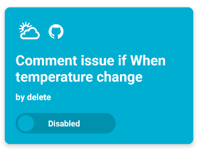

The `AppletProps` interface is defining the structure of an object that represents the props passed
to the `AppletComponent` component. It has the following properties:
* `id` : the id of the applet
* `name` : the name of the applet
* `actionSlug` : the slug of the action of the applet
* `reactionsList` : the list of the reactions of the applet
* `enabled` : a boolean that indicates if the applet is enabled or not
* `author` : the author of the applet

```typescript 
interface AppletProps {
    id: number;
    name: string;
    actionSlug: string;
    reactionsList: ReactionListProps[];
    enabled: boolean;
    author: string;
}
```

The `ReactionListProps` interface is defining the structure of an object that represents a list of
reactions for an applet. It has two properties:
* `reactionSlug` : the slug of the reaction
* `reactionData` : the data of the reaction

```Typescript
interface ReactionListProps {
    reactionSlug: string;
    reactionData: any[];
}
```

This permit to create the following `AppletComponent` component:

```typescript
const AppletComponent: React.FC<AppletProps> = ({ id, name, actionSlug, reactionsList, enabled, author }) 
```

The code is using the `React.useState` hook to define and initialize state variables in the
`AppletComponent` component.

```typescript
    const [bgColor, setBgColor] = useState<string>("");
    const navigation: any = useNavigation();
    const [loading, setLoading] = useState<boolean>(false);
```

We create a function to fetch the data. The function `dataFetch` is an asynchronous function that fetches data using the `AppletDetails`
function and sets the background color based on the fetched data. The `slug` parameter is a string that represents a unique identifier for 
a specific item or resource. It is used as a parameter in the `dataFetch` function to fetch data related to that specific slug.

```typescript
const dataFetch = async (slug : string) => {
        try {
            const data = await AppletDetails(slug);
            setBgColor(data?.data?.decoration?.backgroundColor);
            setLoading(true);
        } catch (error) {
            console.error(error);
        }
    };
```

The `useEffect` hook is used to perform side effects in a functional component. In this case, it
is used to fetch data and set the background color based on the fetched data.

```typescript
    useEffect(() => {
        dataFetch(actionSlug);
    }, [navigation]);
```

The `return` statement in the code is rendering the JSX elements based on the value of the
`loading` state: 
* If the value of the `loading` state is `false`, the `return` statement is :
```typescript 
        <TouchableOpacity style={{ ...styles.container, backgroundColor: bgColor} } onPress={() => navigation.navigate('MyApplets', { id: id })}>
            <View style={[ styles.card, {marginBottom: 10, flexWrap: "wrap" }]}>
                    {actionSlug && (
                        <LogoApplet
                        slug={actionSlug}
                        color={bgColor}
                        />
                    )}
                    {/* Loop through reactionsList */}
                    {reactionsList && reactionsList.map((reaction: any, index: number) => (
                        <View key={index} style={{  }}>
                            <ReactionLogo
                                reaction={reaction}
                                bgColor={bgColor}
                            />
                        </View>
                    ))}
            </View>
            <View style={ { ...styles.card, marginBottom: 10 } }>
                <Text style={ [ styles.title, { color: getWriteColor(bgColor) }] }>
                {name}
                </Text>
            </View>
            <Text style={ styles.author }>
                by {author}
            </Text>
            <View style={[ styles.card, { marginTop: '3%'}] }>
                <ToggleSwitch
                    isChecked={enabled}
                    isDisabled={false}
                    yesLabel="Enabled"
                    noLabel="Disabled"
                    bgColor={bgColor}
                />
            </View>
        </TouchableOpacity>
```
* Otherwise, the `return` statement is a loading logo:

```typescript
<View style={{backgroundColor: bgColor, flex: 1, justifyContent: 'center', alignItems: 'center'}}>
    <ActivityIndicator size="large" color="#363841" />
</View>
```

The `ReactionLogo` component renders a logo based on the given reaction and background color. It takes `reaction` as parameter: This is an object that contains information about a reaction. It likely has
properties such as `reactionSlug` which is a string representing the slug of the reaction. The `ReactionLogo` component is returning a `LogoApplet` component with the `slug` prop set
to the first part of the `reactionSlug` string (obtained by splitting it at the dot) and the `color` prop set to the value of the `bgColor` prop.

```typescript
const ReactionLogo: React.FC<ReactionProps> = ({ reaction, bgColor }) => {
    return (
        <LogoApplet
            slug={reaction.reactionSlug.split(".")[0]}
            color={bgColor}
        />
    );
};
```

The `ReactionProps` interface is defining the structure of an object that represents the props
passed to the `ReactionLogo` component. It has two properties:

```Typescript
interface ReactionProps {
    reaction: ReactionListProps;
    bgColor: string;
}
```

The `const styles` declaration is creating a JavaScript object that contains a set of styles for the
components in the React Native code. The `StyleSheet.create()` function is used to create a
stylesheet object that optimizes the styles for performance.

```typescript
const styles = StyleSheet.create({
    container: {
        borderRadius: 10,
        padding: 20,
        margin: 15,
        width: '85%',
        justifyContent: 'space-between',
        shadowColor: '#000000',
        shadowOffset: {
            width: 0,
            height: 5,
        },
        shadowOpacity: 0.5,
        shadowRadius: 10,
        elevation: 5,
    },
    author: {
        color: 'white',
        fontSize: 16,
        marginBottom: 10,
        fontWeight: 'bold',
    },
    card: {
        flexDirection: 'row',
        alignItems: 'center'
    },
    title: {
        fontWeight: 'bold',
        color: 'white',
        fontSize: 26
    },
});
```

The `export default AppletComponent;` statement is exporting the `AppletComponent` component as the
default export of the module. This means that when another file imports this module, it can access
the `AppletComponent` component directly without having to specify its name in curly braces. For
example, in another file, you can import the `AppletComponent` like this: `import AppletComponent
from './AppletComponent';`.

```javascript 
export default AppletComponent;
```

For more information about this file you can check his complete code here : [Activity.tsx](https://github.com/maelbecel/ARea/blob/master/mobile/Area51/components/Applets/AppletComponent.tsx)


## [AppletInfoContainer.tsx](https://github.com/maelbecel/ARea/blob/master/mobile/Area51/components/Applets/AppletInfoContainer.tsx)

The `AppletInfoContainer` component is the component that will be used to display the information of an applet in the mobile application. It is a simple component that will display the name of the applet, the icon of the applet, the description of the applet, the author of the applet and the reactions of the applet.

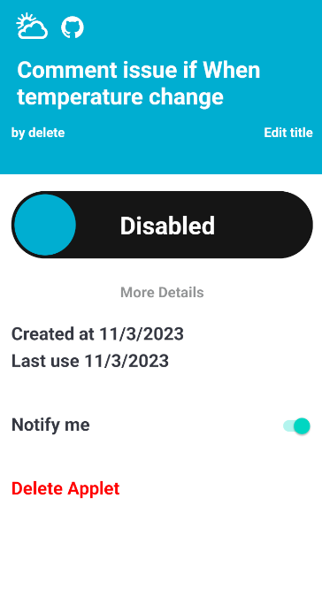


The `AppletInfoContainerProps` interface is defining the type of props that the
`AppletInfoContainer` component expects to receive. It specifies the names and
types of the props, such as `name` (a string), `color` (a string), `actionSlug`
(a string), `reactionSlug` (a string), `user` (a string), `enabled` (a
boolean), `createdAt` (a number), and `lastTriggerDate` (a number). By defining
this interface, it helps ensure that the component is used correctly and that
the props passed to it have the expected types. Here are the props that the
`AppletInfoContainer` component expects to receive:
* `name` : the name of the applet
* `color` : the color of the applet
* `actionSlug` : the slug of the action of the applet
* `reactionsList` : the list of the reactions of the applet
* `user` : the author of the applet
* `enabled` : a boolean that indicates if the applet is enabled or not
* `id` : the id of the applet
* `createdAt` : the date of creation of the applet
* `lastTriggerDate` : the date of the last trigger of the applet
* `notif` : a boolean that indicates if the applet has notifications or not

```typescript
interface AppletInfoContainerProps {
    name: string;
    color: string;
    actionSlug: string;
    reactionsList: ReactionListProps[];
    user: string;
    enabled: boolean;
    id: number;
    createdAt?: number;
    lastTriggerDate?: number;
    notif: boolean;
}
```

The `ReactionListProps` interface is defining the type of props that the `AppletInfoContainer`
component expects to receive for the `reactionsList` prop. It specifies that the `reactionsList`
prop should be an array of objects with two properties:
* `reactionSlug` : the slug of the reaction
* `reactionData` : the data of the reaction

```typescript
interface ReactionListProps {
    reactionSlug: string;
    reactionData: any[];
}
```

The `AppletInfoContainer` component is a functional component that takes the
`AppletInfoContainerProps` as a parameter. It returns a `View` component that
contains the JSX elements that will be rendered by the component.

```Typescript
const AppletInfoContainer: React.FC<AppletInfoContainerProps> = ({ name, color, actionSlug, reactionsList, user, enabled, id, createdAt = 0, lastTriggerDate = 0, notif })
```

The code is using the `React.useState` hook to define and initialize state variables in the
`AppletInfoContainer` component.

```Typescript 
    const [formattedDate, setFormattedDate] = useState<string>("");
    const [LastUseDate, setLastUseDate] = useState<string>("");
    const [title, setTitle] = useState<string>(name);
    const navigation: any = useNavigation();
```

The `useEffect` hook in this code is used to perform side effects in a
functional component. It takes two arguments: a callback function and an array
of dependencies. The function `dataFetch` retrieves data, formats dates, and stores an applet ID in AsyncStorage.

```Typescript
    useEffect(() => {
        const dataFetch = async () => {
            if (createdAt !== 0) {
                const createdAtDate = new Date(createdAt * 1000);
                const lastUpdateDate = new Date(lastTriggerDate * 1000);
                const formattedDate = createdAtDate.toLocaleDateString('en-US', { year: 'numeric', month: '2-digit', day: 'numeric' });
                const formattedLastUseDate = lastUpdateDate.toLocaleDateString('en-US', { year: 'numeric', month: '2-digit', day: 'numeric' });
                setLastUseDate(formattedLastUseDate);
                setFormattedDate(formattedDate);
            }
            await AsyncStorage.setItem('appletID', id.toString());
        };
        dataFetch();
    }, []);
```

The function `handleTitleChange` updates the title state and saves it to AsyncStorage if the text length is less than 141 characters. The `text` parameter is a string that represents the new title value that
is being passed to the `handleTitleChange` function.

```typescript 
    const handleTitleChange = async (text: string) => {
        if (text.length < 141) {
            setTitle(text);
            await AsyncStorage.setItem('title', text);
        }
    };
```

The return statement in the code is rendering the JSX elements in two parts:
* The first part contain the header of the applet :

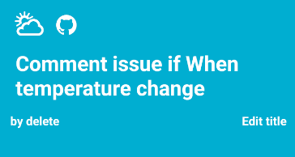

```typescript 
            <View style={{ ...styles.header, backgroundColor: color.toLocaleLowerCase() == "#ffffff" ? "#eeeeee" : color }}>
                {/* The applet's logo */}
                <View style={{ flexDirection: 'row', flexWrap: 'wrap', alignContent: 'center', justifyContent: 'flex-start' }}>
                    <TouchableOpacity onPress={() => navigation.navigate('Info', { slug: actionSlug.split('.')[0] })}>
                        {actionSlug &&
                            <LogoApplet
                                slug={actionSlug.split('.')[0]}
                                color={color}
                            />}
                    </TouchableOpacity>
                    {/* Loop through reactionsList */}
                    {reactionsList && reactionsList.map((reaction: any, index: number) => (
                        <View key={index}>
                            <TouchableOpacity onPress={() => navigation.navigate('Info', { slug: reaction.reactionSlug.split('.')[0] })}>
                                <LogoApplet
                                    slug={reaction.reactionSlug.split('.')[0]}
                                    color={color}
                                />
                            </TouchableOpacity>
                        </View>
                    ))}
                </View>

                {/* The title of the applet */}
                <OutlinedTitleBox value={title} bgColor={color} author={user} onChangeText={handleTitleChange} />

            </View>
```

* The second part is the body of the container :

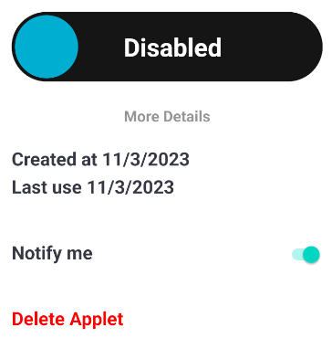

```Typescript
            <View style={styles.body}>
                {/* The toggle switch that enables or disables the applet */}
                <View style={styles.toggleSwitch}>
                    <ToggleSwitch
                        isChecked={enabled}
                        isDisabled={false}
                        yesLabel="Enabled"
                        noLabel="Disabled"
                        bgColor='#121212'
                        toggleColor={color.toLocaleLowerCase() == "#ffffff" ? "#eeeeee" : color}
                        darkMode={false}
                        bigSwitch={true}
                    />
                </View>

                <MoreDetailsButton isToggle={false} actionSlug={actionSlug} reactionsList={reactionsList} />

                <Text style={{ color: '#363841', fontWeight: 'bold', fontSize: 22, marginTop: '1%' }}>
                    {formattedDate ? (
                        `Created at ${formattedDate}`
                    ) : (
                        "Date of creation not accessible"
                    )}
                </Text>
                <Text style={{ color: '#363841', fontWeight: 'bold', fontSize: 22, marginTop: '1%' }}>
                    {LastUseDate ? (
                        `Last use ${formattedDate}`
                    ) : (
                        "Never used yet"
                    )}
                </Text>
                <View style={{ flexDirection: 'row', justifyContent: 'space-between', marginVertical: '10%', alignContent: 'center', alignItems: 'center' }}>
                    <Text style={{ color: '#363841', fontWeight: 'bold', fontSize: 22, alignContent: 'center', alignItems: 'center' }}>Notify me</Text>
                    <SwitchNotifyMe isChecked={notif} isDisabled={false} />
                </View>
                <DeleteModal id={id} />
            </View>
```

The `const styles` declaration is creating a JavaScript object that contains a set of styles for
different elements in the `AppletInfoContainer` component. Each key in the object represents a style
property, such as `container`, `header`, `title`, `text`, `toggleSwitch`, and `body`. The
corresponding value for each key is an object that defines the specific style properties and their
values for that element.

```typescript
const styles = StyleSheet.create({
    container: {
        backgroundColor: '#fff',
    },
    header: {
        paddingHorizontal: '5%',
        paddingTop: '3%',
        paddingBottom: '10%',
        marginBottom: '5%',
    },
    title: {
        fontSize: 28,
        fontWeight: 'bold',
        paddingVertical: '2%',
        paddingHorizontal: '2%',
        marginBottom: '2%',
    },
    text: {
        fontSize: 16,
    },
    toggleSwitch: {
        flexDirection: 'row',
        alignItems: 'center',
        justifyContent: 'center',
        marginBottom: '5%',
    },
    body: {
        paddingHorizontal: '5%',
        marginBottom: '5%',
    },
});
```

The `export default AppletInfoContainer;` statement is exporting the `AppletInfoContainer` component
as the default export of the module. This means that when another file imports this module, it can
access the `AppletInfoContainer` component directly without having to specify its name in curly
braces. For example, in another file, you can import the `AppletInfoContainer` like this: `import
AppletInfoContainer from './AppletInfoContainer';`.

```typescript
export default AppletInfoContainer;
```

For more information about this file you can check his complete code here : [AppletInfoContainer.tsx](https://github.com/maelbecel/ARea/blob/master/mobile/Area51/components/Applets/AppletInfoContainer.tsx)

## [Logo.tsx](https://github.com/maelbecel/ARea/blob/master/mobile/Area51/components/Applets/Logo.tsx)

The `Logo` component is the component that will be used to display the logo of an applet in the mobile application. It is a simple component that will display the logo of the applet.


The `interface CardProps` is defining the props that can be passed to the `LogoApplet` component. It
extends the `TouchableOpacityProps` interface, which includes all the props that can be passed to
the `TouchableOpacity` component from React Native. It has the following properties:
* `slug` : the slug of the service
* `onPress` : a function that will be called when the user presses the logo
* `color` : the color of the logo background

```typescript 
interface CardProps extends TouchableOpacityProps {
    slug    : string;
    onPress ?: () => void;
    color   ?: string;
}
```

The `LogoApplet` component is a functional component that takes the `CardProps` as a parameter. The component renders a `TouchableOpacity` or `View` depending on whether the `onPress`
prop is defined or not. It displays a logo from of a service.

```typescript
const LogoApplet: React.FC<CardProps> = ({ slug , onPress, color = "#ffffff"}) 
```

The code is using the `React.useState` hook to define and initialize state variables in the
`LogoApplet` component.

```typescript
    const [bgColor, setColor] = React.useState<string>("EEEEEE");
    const [logo, setLogo] = React.useState<string>("https://via.placeholder.com/50");
    const [loading, setLoading] = React.useState<boolean>(true);
```

The `React.useEffect` hook is used to perform side effects in functional components. In this
case, it is used to fetch information from the `ServiceInfo` API and update the component's
state.

```typescript 
    React.useEffect(() => {
        const fetchInfos = async () => {
            const res = await ServiceInfo(slug);
            setColor(res.decoration.backgroundColor);
            setLogo(res.decoration.logoUrl);
            setLoading(false);
        }
        fetchInfos();
    }, []);
```

The function checks if a given color is light or not. It uses a `color` parameter that is a string representing a color.
It returns true if the color is considered light, and false if not
```typescript
    const isLight = (color: string) => {
        if (color.charAt(0) === '#') {
            color = color.substr(1);
        }
        if (color.length === 3) {
            color = color.charAt(0) + color.charAt(0) + color.charAt(1) + color.charAt(1) + color.charAt(2) + color.charAt(2);
        }
        if (color.toLocaleLowerCase() === 'ffffff') {
            return false;
        }
        return true;
    }
```

Then, if `loading` is true the component will be display in two different ways :
* If `onPress` is defined, a `TouchableOpacity`
```typescript 
<TouchableOpacity onPress={onPress} style={[{ backgroundColor: isLight(color) ? null : bgColor }, styles.container]}>
    <Image source={{ uri: logo, cache: 'force-cache'}} style={[styles.logopti]} />
</TouchableOpacity>
```
* Otherwise, a `View`
```typescript
<View style={[{ backgroundColor: isLight(color) ? null : bgColor }, styles.container]}>
    <Image source={{ uri: logo, cache: 'force-cache' }} style={[styles.logopti]} />
</View>
```

The `const styles` variable is an object that contains style definitions for the `LogoApplet`
component. It uses the `StyleSheet.create` method from React Native to create a stylesheet object.

```typescript
  const styles = StyleSheet.create({
    container: {
        alignContent: 'center',
        justifyContent: 'center',
        height: 50,
        width: 50,
        borderRadius: 10,
    },
    logopti: {
        height: 40,
        width: 40,
        alignSelf: 'center',
    }
  });
```

The `export default LogoApplet;` statement is exporting the `LogoApplet` component as the default
export of the module. This means that when another file imports this module, it can access the
`LogoApplet` component directly without having to specify its name in curly braces. For example, in
another file, you can import the `LogoApplet` like this: `import LogoApplet from './LogoApplet';`.

```typescript
export default LogoApplet;
```

For more information about this file you can check his complete code here : [Logo.tsx](https://github.com/maelbecel/ARea/blob/master/mobile/Area51/components/Applets/Logo.tsx)

## [MoreDetails.tsx](https://github.com/maelbecel/ARea/blob/master/mobile/Area51/components/Applets/MoreDetails.tsx)

The `MoreDetails` component is the component that will be used to display the details of an applet in the mobile application. It is a simple component that will display the details of the applet.

{style="inline"}


The `ButtonProps` interface is defining the type of props that the `MoreDetailsButton` component
expects to receive. It has three properties:
* `isToggle` : a boolean that indicates if the button is a toggle or not
* `actionSlug` : the slug of the action of the applet
* `reactionsList` : the list of the reactions of the applet

```typescript
interface ButtonProps {
    isToggle: boolean;
    actionSlug: string;
    reactionsList: ReactionListProps[];
}
```

The `ReactionListProps` interface is defining the type of props that the `MoreDetailsButton`
component expects to receive. It has two properties:
* `reactionSlug` : the slug of the reaction
* `reactionData` : the data of the reaction

```typescript
interface ReactionListProps {
    reactionSlug: string;
    reactionData: any[];
}
```

The `MoreDetailsButton` component is a React functional component that displays a button that
toggles between showing more details and fewer details.

```typescript
const MoreDetailsButton = ({ isToggle, actionSlug, reactionsList }: ButtonProps)
```

The code is using the `React.useState` hook to define and initialize state variables in the
`MoreDetailsButton` component.

```typescript
    const [isButtonToggle, setIsButtonToggle] = useState<boolean>(isToggle);
    const [actionInfos, setActionInfos] = useState<any>("");
    const [reactionInfos, setReactionInfos] = useState<any>("");
    const [loading, setLoading] = useState<boolean>(true);
```

The handleClick function toggles the value of isButtonToggle.

```typescript
    const handleClick = () => {
        setIsButtonToggle(!isButtonToggle);
    };
```

The `useEffect` hook is used to perform side effects in a functional component. In this case,
the `useEffect` hook is used to fetch data from the server and update the component's state.
The function `dataFetch` fetches action and reaction information, sets the fetched data in
state variables, and handles any errors that occur during the process.

```typescript 
    useEffect(() => {
        const dataFetch = async () => {
            try {
                const actionInfos = await ActionInfo(actionSlug);
                const reactionInfos = [];
                for (let i = 0; i < reactionsList.length; i++) {
                    const reactionInfo = await ReactionInfo(reactionsList[i].reactionSlug);
                    reactionInfos.push(reactionInfo);
                }
                setActionInfos(actionInfos);
                setReactionInfos(reactionInfos);
                setLoading(false);
            } catch (error) {
                console.error(error);
            }
        };
        dataFetch();
    }, []);
```

The `return` statement in the code is rendering the JSX elements based on the value of the
`loading` state and the `isButtonToggle` status. It has two different return possibility:
* The first one if the `isButtonToggle` is `true`, we return the information about the applets.

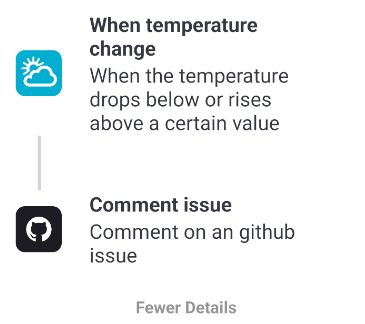

```typescript
                <View>
                    <View>
                        <View style={{ flexDirection: "row", alignItems: "center" }}>
                            <View>
                                {actionSlug &&
                                <LogoApplet
                                    slug={actionSlug.split('.')[0]}
                                />}
                            </View>

                            <View style={{ marginLeft: 30, width: '70%' }}>
                                <Text style={{ color: "#363841", fontWeight: "bold", fontSize: 22 }}>{actionInfos.name}</Text>
                                <Text style={{ color: "#363841", fontSize: 22 }}>{actionInfos.description}</Text>
                            </View>
                        </View>
                    </View>


                    <View>
                        {/* Loop through reactionsList */}
                        {reactionsList && reactionsList.map((reaction: any, index: number) => (
                        <View key={index}>
                            <View style={ styles.separator } />
                            <View style={{ flexDirection: "row", alignItems: "center" }}>
                                <LogoApplet
                                slug={reaction.reactionSlug.split('.')[0]}
                                />
                                <View style={{ marginLeft: 30, width: '70%' }}>
                                    <Text style={{ color: "#363841", fontWeight: "bold", fontSize: 22 }}>{reactionInfos[index].name}</Text>
                                    <Text style={{ color: "#363841", fontSize: 22 }}>{reactionInfos[index].description}</Text>
                                </View>
                            </View>
                        </View>
                        ))}
                    </View>
                    <TouchableOpacity onPress={handleClick} style={{ alignItems: "center", marginTop: 30, marginBottom: 20 }}>
                        <Text style={{ color: "#939596", fontWeight: "bold", fontSize: 18 }}>Fewer Details</Text>
                    </TouchableOpacity>
                </View>
```

* Otherwise, we return the button to show more details.


```typescript
<TouchableOpacity onPress={handleClick} style={{ alignItems: "center", marginTop: 10, marginBottom: 20 }}>
     <Text style={{ color: "#939596", fontWeight: "bold", fontSize: 18 }}>More Details</Text>
</TouchableOpacity>
```

The `const styles` variable is an object that contains a style definition for a separator element.
The `StyleSheet.create()` function is used to create a stylesheet object that can be used to define
styles for React Native components. In this case, the `separator` style defines the padding,
background color, and margins for the separator element.

```typescript
const styles = StyleSheet.create({
    separator: {
        paddingVertical: "8%",
        backgroundColor: "#36384138",
        marginRight: "92.5%",
        marginLeft: "6.5%",
    },
});
```

The line `export default MoreDetailsButton;` is exporting the `MoreDetailsButton` component as the
default export of the module. This means that when another file imports this module, it can import
the `MoreDetailsButton` component using any name of its choice. For example, in another file, you
can import the `MoreDetailsButton` component like this: `import CustomButton from
"./MoreDetailsButton";`.
```typescript
export default MoreDetailsButton;
```

For more information about this file you can check his complete code here : [MoreDetails.tsx](https://github.com/maelbecel/ARea/blob/master/mobile/Area51/components/Applets/MoreDetails.tsx)


## [SearchApplet.tsx](https://github.com/maelbecel/ARea/blob/master/mobile/Area51/components/Applets/SearchApplet.tsx)

The `SearchApplet` component is the component that will be used to display the search bar of the applets in the mobile application. It is a simple component that will display the search bar of the applets.

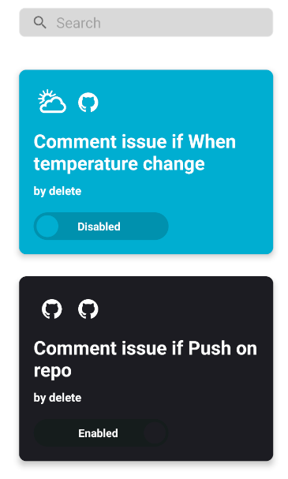

The code defines a functional component called `SearchApplet` using TypeScript and React.
```typescript 
const SearchApplet: React.FC = () 
```

The code is using the `React.useState` hook to define and initialize state variables in the
`SearchApplet` component.

```typescript
    const [applets, setApplets] = useState<any>(null); // State to store applets
	const [dispApplets, setDispApplets] = useState<any>(null); // State to store applets
	const [loading, setLoading] = useState<boolean>(true); // State to store loading state
	const [refreshing, setRefreshing] = useState<boolean>(false); // State to store refreshing state
	const navigation: any = useNavigation(); // Navigation hook
```

The function `reduceTitle` takes a string `title` as input and returns a shortened version of the
title if it exceeds 50 characters, otherwise it returns the original title.
The `title` parameter is a string that represents the title of a text or document.
The function `reduceTitle` returns a modified version of the input `title` string. If the
length of the `title` is greater than 50 characters, it returns the first 50 characters of the `title` followed by an ellipsis ("..."). Otherwise, it returns the original `title` string.

```Typescript
    const reduceTitle = (title: string) => {
		if (title.length > 50) {
			return title.slice(0, 50) + "...";
		}
		return title;
	};
```

The `onRefresh` function is a callback function that is used to handle the refresh action in the
ScrollView component. It sets the `refreshing` state to true and calls the `fetchApplets` function.

```typescript
    const onRefresh = useCallback(async () => {
		setRefreshing(true);
		setApplets(null);
		setDispApplets(null);
		await dataFetch();
		setTimeout(() => {
		  setRefreshing(false);
		}, 1000);
	}, []);
```

The function filters an array of applets based on a given name and updates the displayed applets.

```Typescript
    const filterApplets = (name : string) => {
		if (applets == null) return;
		let tmp = applets.filter((service: any) => service.name.toLowerCase().includes(name.toLowerCase()));
		setDispApplets(tmp);
	}
```

The function `dataFetch` is an asynchronous function that fetches data from the `AppletMe` API and
updates the state variables `applets`, `dispApplets`, and `loading` accordingly.

```typescript 
    const dataFetch = async () => {
	  try {
		const data: any = await AppletMe();
		setApplets(data.data);
		setDispApplets(data.data);
		setLoading(false);
	} catch (error) {
		console.error("error applet component", error);
	  }
	};
```

The `useEffect` hook is used to perform side effects in functional components. In this case, the
`useEffect` hook is used to add a listener to the navigation focus event.

```Typescript
    useEffect(() => {
		const listener = navigation.addListener("focus", () => {
			dataFetch();
		});
	}, []);
```

The `return` statement in the code is rendering the JSX elements divide in two parts:

* The first part is the search bar :


```Typescript
            <View style={styles.input}>
			  <FormInput
				title="Search"
				icon={{ name: "search", width: 27, height: 27 }}
				onChangeText={(text) => {
				  filterApplets(text);
				}}
				size="85%"
			  />
			</View>
```

* The second part is the applet display:

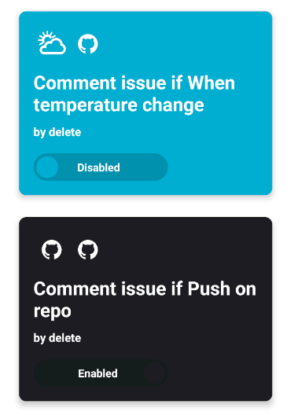


```Typescript
            {(!loading && dispApplets) ? dispApplets.map((item: any) => (
			  <View style={styles.applet} key={item.id}>
				<AppletComponent
				  id={item.id}
				  name={reduceTitle(item.name)}
				  reactionsList={item.reactions}
				  actionSlug={item.actionSlug.split(".")[0]}
				  enabled={item.enabled}
				  author={item.user.username}
				/>
			  </View>
			)):
			<View style={{flex: 1, justifyContent: 'center', alignItems: 'center'}}>
				<ActivityIndicator size="large" color="#363841" />
			</View>
			}
```

The `const styles` declaration is creating a JavaScript object that contains a set of styles for the
components in the React Native code. The `StyleSheet.create()` function is used to create a
stylesheet object that optimizes the styles for performance.

```Typescript
const styles = StyleSheet.create({
	input: {
		alignContent: 'center',
		alignItems: 'center',
		marginBottom: 20,
	},
	applet: {
		alignContent: 'center',
		alignItems: 'center',
	},
});
```

The `export default SearchApplet;` statement is exporting the `SearchApplet` component as the
default export of the module. This means that when another file imports this module, it can access
the `SearchApplet` component directly without having to specify its name in curly braces. For
example, in another file, you can import the `SearchApplet` like this: `import SearchApplet from
'./SearchApplet';`.

```typescript
export default SearchApplet;
```

For more information about this file you can check his complete code here : [SearchApplet.tsx](https://github.com/maelbecel/ARea/blob/master/mobile/Area51/components/Applets/SearchApplet.tsx)

## [Switch.tsx](https://github.com/maelbecel/ARea/blob/master/mobile/Area51/components/Applets/Switch.tsx)

The `ToggleSwitch` component is the component that will be used to display the toggle switch of the applets in the mobile application. It is a simple component that will display the toggle switch of the applets.


The `ToggleSwitchProps` interface defines the props that can be passed to the `ToggleSwitch`
component. Here's a breakdown of each prop:
* `isChecked` : a boolean that indicates if the switch is checked or not
* `isDisabled` : a boolean that indicates if the switch is disabled or not
* `yesLabel` : the label of the switch when it is checked
* `noLabel` : the label of the switch when it is not checked
* `bgColor` : the background color of the switch
* `toggleColor` : the color of the switch
* `darkMode` : a boolean that indicates if the switch is in dark mode or not
* `bigSwitch` : a boolean that indicates if the switch is big or not
* `onChange` : a function that will be called when the switch is changed


```Typescript
interface ToggleSwitchProps {
    isChecked: boolean;
    isDisabled: boolean;
    yesLabel: string;
    noLabel: string;
    bgColor: string;
    toggleColor?: string;
    darkMode?: boolean;
    bigSwitch?: boolean;
    onChange?: () => void;
}
```

The `ToggleSwitch` component is a functional component that takes the `ToggleSwitchProps` as a
parameter.

```Typescript
const ToggleSwitch: React.FC<ToggleSwitchProps> = ({ isChecked, isDisabled, yesLabel, noLabel, bgColor, toggleColor, darkMode = true, bigSwitch = false, onChange })
```

The code is using the `React.useState` hook to define and initialize state variables in the
`ToggleSwitch` component.

```Typescript
    const [isChekedState, setIsChecked] = useState<boolean>(false);
    const [darkenBg, setDarkenColor] = useState<string>(bgColor);
```

We can now create the `darkenColor` function that takes a color, a factor, and a dark mode flag, and returns a darkened version of the color if dark mode is enabled.
The `color` parameter is a string representing a color in hexadecimal format (e.g., "#FF0000" for red).
The `factor` parameter determines how much the color should be darkened. It is a number that represents the intensity of darkening. A higher factor value will result in a darker color.
And a boolean value indicating whether the dark mode is enabled or not.
The function `darkenColor` returns a string representing the darkened color.

```Typescript
export const darkenColor = (color: string, factor: number, darkMode: boolean): string => {
    if (!darkMode) {
        return color;
    }
    if (!color) {
        return "#FFFFFF";
    }
    /**
     * The function `hexToRgb` takes a hexadecimal color code as input and returns an array of RGB
     * values representing the color.
     * @param {string} hex - The `hex` parameter is a string representing a hexadecimal color value.
     * @returns The function `hexToRgb` returns an array of numbers representing the RGB values of a
     * given hexadecimal color code. If the input `hex` is a valid string, the function converts it to
     * an array of numbers and returns it. If the input `hex` is not a valid string or is empty, the
     * function returns `[0, 0, 0]`, representing black.
     */
    const hexToRgb = (hex: string): number[] => {
        if (hex) {
            const match = hex.match(/\w\w/g);
            if (match) {
                return match.map((x) => parseInt(x, 16));
            }
        }
        return [0, 0, 0];
    };
    const rgbToHex = (r: number, g: number, b: number): string =>
        `#${(1 << 24 | r << 16 | g << 8 | b).toString(16).slice(1)}`;
    const [r, g, b] = hexToRgb(color);
    const darkenedR = Math.max(0, Math.floor(r / factor));
    const darkenedG = Math.max(0, Math.floor(g / factor));
    const darkenedB = Math.max(0, Math.floor(b / factor));
    const darkenedHex = rgbToHex(darkenedR, darkenedG, darkenedB);
    return rgbToHex(darkenedR, darkenedG, darkenedB);
};
```

The `useEffect` hook is used to perform side effects in a functional component. In this case,
the `useEffect` hook is used to update the state variables `isChekedState` and `darkenBg`
whenever the `isChecked` prop changes.

```Typescript
    useEffect(() => {
        setIsChecked(isChecked);
        setDarkenColor(darkenColor(bgColor, 1.2, darkMode));
    }, [isChecked]);
```
The function `handleSwitchChange` updates the state of a switch component and calls an
asynchronous function to update the enable status of an applet if a condition is met.

```Typescript
    const handleSwitchChange = async () => {
        setIsChecked(!isChekedState);
        if (bigSwitch) {
            await UpdateAppletEnableWithID(await AsyncStorage.getItem("appletID"), !isChekedState);
        };
    }
```

The `return` statement in the code is rendering the JSX elements based on the value of the
`bigSwitch` prop. If the `bigSwitch` prop is `true`, the `ToggleSwitch` component will be rendered.

```Typescript
return (
        <TouchableOpacity
            onPress={handleSwitchChange}
            style={[styles.container, {
                backgroundColor: darkenBg,
                width: bigSwitch ? '100%' : '60%',
                borderRadius: bigSwitch ? 50 : 100,
                justifyContent: isChekedState ? 'flex-end' : 'flex-start',
            }]}
            disabled={isDisabled}
        >
            {isChekedState ? (
                <>
                <Text style={[styles.label, {
                    marginRight: bigSwitch ? '15%' : '20%',
                    color: getWriteColor(darkenBg),
                    fontSize: bigSwitch ? 30 : 15,
                }]}>{isChekedState ? yesLabel : noLabel}</Text>
                <View style={[, {
                    width: bigSwitch ? 75 : 30,
                    height: bigSwitch ? 75 : 30,
                    borderRadius: bigSwitch ? 37.5 : 15,
                    backgroundColor: toggleColor ? toggleColor : bgColor }
                ]}/>
                </>
            ) : (
            <>
                <View style={[, {
                    width: bigSwitch ? 75 : 30,
                    height: bigSwitch ? 75 : 30,
                    borderRadius: bigSwitch ? 37.5 : 15,
                    backgroundColor: toggleColor ? toggleColor : bgColor }
                ]}/>
                <Text style={[styles.label, {
                    marginLeft: bigSwitch ? '15%' : '15%',
                    color: getWriteColor(darkenBg),
                    fontSize: bigSwitch ? 30 : 15,
                }]}>{isChekedState ? yesLabel : noLabel}</Text>
            </>
            )}
        </TouchableOpacity>
    );
};
```

The `const styles` variable is an object that contains style definitions for different elements in
the `ToggleSwitch` component. It uses the `StyleSheet.create` method from the `react-native` library
to create a stylesheet with optimized performance.

```Typescript
const styles = StyleSheet.create({
    container: {
        flexDirection: "row",
        alignItems: "center",
        padding: 4,
    },
    label: {
        fontWeight: "bold",
    },
    disabled: {
        opacity: 1, // Opacité lorsque le toggle est désactivé
    },
});
```

The `export default ToggleSwitch;` statement is exporting the `ToggleSwitch` component as the
default export of the module. This means that when another file imports this module, it can access
the `ToggleSwitch` component directly without having to specify its name in curly braces. For
example, in another file, you can import the `ToggleSwitch` like this: `import ToggleSwitch from
'./ToggleSwitch';`.

```Typescript
export default ToggleSwitch;
```


For more information about this file you can check his complete code here : [Switch.tsx](https://github.com/maelbecel/ARea/blob/master/mobile/Area51/components/Applets/Switch.tsx)

## [SwitchNotifyMe.tsx](https://github.com/maelbecel/ARea/blob/master/mobile/Area51/components/Applets/SwitchNotifyMe.tsx)

The `SwitchNotifyMe` component is the component that will be used to display the toggle switch of the applets in the mobile application. It is a simple component that will display the toggle switch of the applets.


The `SwitchProps` interface defines the props that can be passed to the `SwitchNotifyMe`
component. Here's a breakdown of each prop:
* `isChecked` : a boolean that indicates if the switch is checked or not
* `isDisabled` : a boolean that indicates if the switch is disabled or not

```Typescript
interface SwitchProps {
    isChecked: boolean;
    isDisabled: boolean;
}
```

The SwitchNotifyMe component is a switch toggle that allows the user to enable or disable
notifications for a specific applet.

```Typescript
const SwitchNotifyMe: React.FC<SwitchProps> = ({ isChecked, isDisabled })
```

The code is using the `React.useState` hook to define and initialize state variables in the
`SwitchNotifyMe` component.

```Typescript
    const [isChekedState, setIsChecked] = useState<boolean>(isChecked);
    const [appletID, setAppletID] = useState<string>("");
```
The `useEffect` hook is used to perform side effects in a functional component. In this case,
the `useEffect` hook is being used to fetch data from the AsyncStorage, which is an asynchronous
storage system in React Native.

```Typescript
    useEffect(() => {
        const getData = async () => {
            const id = await AsyncStorage.getItem("appletID");
            setAppletID(id);
        };
        getData();
    }, []);
```

The function `handleSwitchChange` toggles the value of `isChecked` state and updates an applet
notification with the new value.

```Typescript
    const handleSwitchChange = async () => {
        setIsChecked(!isChekedState);
        await UpdateAppletNotifWithID(appletID, !isChekedState);
    };
```

The `return` statement in the code is rendering the JSX elements.

```Typescript
    return (
        <View style={{ marginTop: 5 }}>
            <RNSwitch
                value={isChekedState}
                onValueChange={handleSwitchChange}
                disabled={isDisabled}
            />
        </View>
    );
```

The line `export default SwitchNotifyMe;` is exporting the `SwitchNotifyMe` component as the default
export of the module. This means that when another file imports this module, it can import the
`SwitchNotifyMe` component directly without having to specify its name in curly braces. For example,
in another file, you can import the `SwitchNotifyMe` component like this: `import SwitchNotifyMe
from "./SwitchNotifyMe";`.

```Typescript
export default SwitchNotifyMe;
```

For more information about this file you can check his complete code here : [SwitchNotifyMe.tsx](https://github.com/maelbecel/ARea/blob/master/mobile/Area51/components/Applets/SwitchNotifyMe.tsx)

## [ActionCard.tsx](https://github.com/maelbecel/ARea/blob/master/mobile/Area51/components/ActionCard.tsx)

The `ActionCard` component is the component that will be used to display the action card of the applets in the mobile application. It is a simple component that will display an action/reaction in a card.

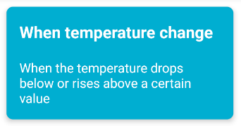

The `CardProps` interface is defining the type of props that the `ActionCard` component expects to
receive. It has three properties:
* `name` : the name of the action/reaction
* `color` : the color of the action/reaction
* `description` : the description of the action/reaction
* `onPress` : a function that will be called when the user presses the card

```Typescript
interface CardProps extends TouchableOpacityProps {
    name   : string;
    color   : string;
    description    : string;
    onPress: () => void;
}
```

The following code is defining a functional component called `ActionCard`.

```Typescript
const ActionCard: React.FC<CardProps> = ({ name, color, description, onPress })
```

First, we set a color by default if the color is an empty string.

```Typescript
    if (color == "") {
        color = "#EEEEEE";
    }
```

Then we return a `TouchableOpacity` that contain the card.

```Typescript
    return (
        <TouchableOpacity onPress={onPress} style={[{backgroundColor: color}, styles.container]}>
          <View>
            <Text style={[styles.name, {color: getWriteColor(color)}]}>{name}</Text>
            <Text style={[styles.desc, {color: getWriteColor(color)}]}>{description}</Text>
          </View>
        </TouchableOpacity>
    );
```

The `const styles = StyleSheet.create({ ... })` block is defining a JavaScript object called
`styles` that contains various style properties for the `ActionCard` component. Each property in
the `styles` object represents a different style rule, such as `container`, `logo`, and `name`.
These style rules define the visual appearance of the `ActionCard` component.

```Typescript
const styles = StyleSheet.create({
    container: {
      paddingTop: 20,
      paddingHorizontal: 20,
      marginVertical: 15,
      width: '85%',
      borderRadius: 10,
      shadowColor: '#000',
        shadowOffset: {
        width: 0,
        height: 2,
        },
        shadowOpacity: 0.3,
        shadowRadius: 3.84,
        elevation: 5,
    },
    logo: {
        height: 70,
        width: 70,
        marginVertical: 10,
        alignSelf: 'center',
    },
    name: {
      fontSize: 25,
      fontWeight: 'bold',
      marginTop: 2,
      marginBottom: 20,
    },
    desc: {
        fontSize: 20,
        marginTop: 5,
        marginBottom: 20,
      }
  });
```

The line `export default ActionCard;` is exporting the `ActionCard` component as the default
export of the module. This means that when another file imports this module, it can import the
`ActionCard` component using the default import syntax, like `import ActionCard from
'./ActionCard'`. 

```Typescript
export default ActionCard;
```

For more information about this file you can check his complete code here : [ActionCard.tsx](https://github.com/maelbecel/ARea/blob/master/mobile/Area51/components/ActionCard.tsx)


## [ActionChoose.tsx](https://github.com/maelbecel/ARea/blob/master/mobile/Area51/components/ActionChoose.tsx)

The `ActionChoose` component is the component that will be used to display the action choose of the applets in the mobile application. It is a simple component that will display the action choose of the applets.
It's used at the creation/edit of an applet to show either "Action" or "Reaction" in a card if no slug exist.

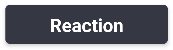

Or a card that corresponding to the slug if he is defined.

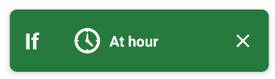

The `interface CardProps` is defining a new interface called `CardProps` that extends the
`TouchableOpacityProps` interface. It specifies the expected props for the `ActionCard` component.
The `CardProps` interface has four properties:
* `slug` : the slug of the action/reaction
* `type` : the type of the card (action or reaction)
* `onPress` : a function that will be called when the user presses the card
* `onPressCross` : a function that will be called when the user presses the cross

```Typescript
interface CardProps extends TouchableOpacityProps {
slug    : string;
type    : string;
onPress : () => void;
onPressCross ?: () => void;
}
````

The `ActionChoose` function is a React functional component that renders an action card based on the
provided `type`, `slug`, and `onPress` props.

```Typescript
const ActionChoose: React.FC<CardProps> = ({ slug, type, onPress, onPressCross })
```

Then we create multiple function to render the component

The function `getServiceFromSlug` takes a slug as input and returns the service name by splitting
the slug at the first occurrence of a period. That return the service name extracted from the given slug.
```Typescript
const getServiceFromSlug = (slug: string): string => {
    const service = slug.split(".")[0];
    return service;
}
```

The function `getActionName` takes in a `Service` object and a `slug` string, and returns the name
of the action or reaction that matches the given slug. The `info` parameter is of type `Service`, which likely represents some
information about a service or platform. It could contain properties like `actions` and `reactions`,
which are arrays of objects representing different actions and reactions available in the service.
The `slug` parameter is a string that represents the unique identifier of an action or reaction.
The function `getActionName` returns a string.

```Typescript
const getActionName = (info : Service, slug: string): string => {
    let i : number = 0;
    if (info == null)
        return "";
    while (info.actions[i]) {
        if (info.actions[i].slug === slug) {
            return info.actions[i].name;
        }
        i++;
    }
    i = 0;
    while (info.reactions[i]) {
        if (info.reactions[i].slug === slug) {
            return info.reactions[i].name;
        }
        i++;
    }
    return "";
}
```

The function `ActionCard` returns a React component that renders a TouchableOpacity with a
background color based on the name prop, and a Text component with a color based on the background
color. \
The name parameter is a string that represents the name of the action card.
It could be any text that you want to display on the action card. \
The `onPress` parameter is a function that will be called when the
`TouchableOpacity` component is pressed. It is typically used to handle the action or event that
should occur when the component is pressed. \
It returns a TouchableOpacity component with a View and Text component inside. The TouchableOpacity
component has an onPress event handler and a style prop that sets the background color based on the
value of the name parameter. The Text component has a style prop that sets the color based on the
result of the getWriteColor function.

```Typescript
const ActionCard = (name : string, onPress : any) => {
    if (name === "Action") {
        var color = "#D9D9D9"
    } else {
        var color = "#363841"
    }
    return (
        <TouchableOpacity onPress={onPress} style={[{backgroundColor: color}, styles.container]}>
            <View>
                <Text style={[styles.area, {color: getWriteColor(color)}]}>{name}</Text>
            </View>
        </TouchableOpacity>
    )
}
```

The `ActionChoose` use the `React.useState` hook to define and initialize state variables in the
`ActionChoose` component.

```Typescript
    const [info, setInfo] = React.useState<any>(null);
    const [action, setAction] = React.useState<string>("");
```

The `React.useEffect` hook is used to perform side effects in a functional component. In this
case, the `useEffect` hook is being used to fetch data and update the component's state based on
the `type` and `slug` props.

```Typescript
     React.useEffect(() => {
      if (type !== 'action' && type !== 'reaction' && slug === "default") {
        return;
      }
      const fetchData = async () => {
        if (slug === "default") {
            return;
        }
        try {
          const serviceInfo = await ServiceInfo(getServiceFromSlug(slug));
          setInfo(serviceInfo);
          setAction(getActionName(serviceInfo, slug));
        } catch (error) {
          console.error("Error while getting info : ", error);
        }
      };

      fetchData();
    }, [type, slug]);
```

The code block is checking if the `type` prop is equal to `'action'` and the `slug` prop is
equal to `"default"`. If this condition is true, it returns an `ActionCard` component with the
name `'Action'` and the `onPress` prop.

```Typescript
    if (type === 'action' && slug === "default") {
      return ActionCard('Action', onPress);
    } else if (type === 'reaction' && slug === "default") {
      return ActionCard('Reaction', onPress);
    }
```

The line `const width = (type == "action") ? '70%' : '60%'` is assigning a value to the `width`
variable based on the condition `(type == "action")`.
```Typescript
const width = (type == "action") ? '70%' : '60%'
```


The code block is conditionally rendering a `TouchableOpacity` component with a specific style
and content based on the value of the `info` variable. If the `info` variable is `null`, nothing happens.

```Typescript
    if (info) {
        return (
            <TouchableOpacity onPress={onPress} style={[{ backgroundColor: info.decoration.backgroundColor }, styles.container]}>
                <View style={{ alignItems: 'center', justifyContent: 'space-between', flexDirection: 'row' }}>
                    <Text style={[styles.ifthen, { color: getWriteColor(info.decoration.backgroundColor) }]}>{(type === "action") ? "If" : "Then"}</Text>
                    <View style={{flexDirection: 'row', alignItems: "center", width: "45%"}}>
                        <Image source={{ uri: info.decoration.logoUrl, cache: 'force-cache' }} style={styles.logo} />
                        <Text style={[styles.desc, { color: getWriteColor(info.decoration.backgroundColor) }]}>{action}</Text>
                    </View>
                    <Icon name="close" size={30} color={getWriteColor(info.decoration.backgroundColor)} onPress={onPressCross} />
                </View>
            </TouchableOpacity>

        );
    }
```

The `const styles = StyleSheet.create({ ... })` block is defining a JavaScript object called
`styles` that contains various style properties for the `ActionCard` component. Each property in
the `styles` object represents a different style rule, such as `container`, `logo`, and `name`.
These style rules define the visual appearance of the `ActionCard` component.

```Typescript
const styles = StyleSheet.create({
    container: {
      paddingHorizontal: 20,
      marginVertical: 15,
      width: '85%',
      height: 85,
      alignContent: 'center',
      justifyContent: 'center',
      borderRadius: 10,
      shadowColor: '#000',
        shadowOffset: {
        width: 0,
        height: 2,
        },
        shadowOpacity: 0.3,
        shadowRadius: 3.84,
        elevation: 5,
    },
    logo: {
        height: 40,
        width: 40,
        marginVertical: 10,
        marginRight: 10,
        alignSelf: 'center',
    },
    area: {
        paddingTop: 15,
        fontSize: 40,
        alignSelf: 'center',
        fontWeight: 'bold',
        marginTop: 2,
        marginBottom: 20,
      },
    ifthen: {
        fontSize: 30,
        fontWeight: 'bold',
        marginRight: "-10%",
    },
    name: {
      fontSize: 25,
      fontWeight: 'bold',
      marginTop: 2,
      marginBottom: 20,
    },
    desc: {
        flexWrap: 'wrap',
        textAlign: 'left',
        fontSize: 20,
        fontWeight: 'bold',
      }
  });
```

The line `export default ActionChoose;` is exporting the `ActionChoose` component as the default
export of the module. This means that when another file imports this module, it can import the
`ActionChoose` component using the default import syntax, like `import ActionChoose from
'./ActionChoose'`. 

```Typescript
export default ActionChoose;
```

For more information about this file you can check his complete code here : [ActionChoose.tsx](https://github.com/maelbecel/ARea/blob/master/mobile/Area51/components/ActionChoose.tsx)

## [DeleteAccount.tsx](https://github.com/maelbecel/ARea/blob/master/mobile/Area51/components/DeleteAccount.tsx)

The `DeleteAccount` component is the component that will be used to display the delete account page in the mobile application. It is a simple component that will display the delete account modal.


The code defines a functional component called `DeleteAccount` using TypeScript and React.

```Typescript
const DeleteAccount: React.FC = ()
```

The following code is using the `React.useState` hook to define and initialize state variables in
the `DeleteAccount` component.

```Typescript
    const [modalVisible, setModalVisible] = useState<boolean>(false);
    const navigation: any = useNavigation();
```

The function `handleDelete` deletes a user, removes a token from SecureStore, and navigates to
the Login screen.

```Typescript
 const handleDelete = async () => {
        try {
          await DeleteUser();
          await SecureStore.deleteItemAsync('token_api');
          navigation.navigate('Login');
        } catch (error) {
          console.error(error);
        }
    };
```

The `return` statement in the code is returning the JSX (JavaScript XML) code that defines the
UI of the `DeleteAccount` component.

```Typescript
    return (
        <View style={styles.container}>
            <TouchableOpacity onPress={() => setModalVisible(true)}>
                <Text style={styles.text}>Delete Account</Text>
            </TouchableOpacity>
            <Modal
                transparent={true}
                visible={modalVisible}
                onRequestClose={() => {
                  setModalVisible(false);
                }}
            >
              <View style={styles.modalContainer}>
                <View style={styles.modalContent}>
                  <Text style={ styles.title }>Delete account</Text>
                  <View style={{ flexDirection: 'column', justifyContent: 'space-between' }}>
                    <View>
                        <Text style={ styles.text }>Are you sure you want to delete your account ?</Text>
                        <Text style={ styles.subtitles }>This action cannot be undone.</Text>
                    </View>
                    <View style={{ flexDirection: 'row', justifyContent: 'space-between', marginTop: 25 }}>
                        <Button title="Cancel" onPress={() => setModalVisible(false)} color="#363841" />
                        <Button title="Delete" onPress={handleDelete} color="red" />
                    </View>
                  </View>
                </View>
              </View>
            </Modal>
        </View>
    );
```

The `const styles = StyleSheet.create({})` block is defining a JavaScript object that contains
styles for different elements in the component. The `StyleSheet.create()` function is used to create
a stylesheet object that optimizes the styles for performance.

```Typescript
const styles = StyleSheet.create({
    container: {
        flexDirection: 'row',
        justifyContent: 'space-between',
        alignItems: 'center',
    },
    title: {
        fontSize: 30,
        fontWeight: 'bold',
        marginBottom: 20,
        textAlign: 'center',
    },
    modalContainer: {
        flex: 1,
        justifyContent: 'center',
        alignItems: 'center',
        backgroundColor: 'rgba(0, 0, 0, 0.5)',
    },
    modalContent: {
        backgroundColor: 'white',
        padding: 20,
        borderRadius: 10,
        elevation: 5,
        width: '80%',
    },
    text: {
        fontSize: 16,
        color: 'red',
        fontWeight: 'bold',
        marginBottom: 10,
    },
    subtitles: {
        fontSize: 18,
        color: '#363841',
        marginTop: 10,
        fontWeight: 'bold',
    },
});
```
The line `export default DeleteAccount;` is exporting the `DeleteAccount` component as the default
export of the file. This allows other files to import and use the `DeleteAccount` component by using
the `import` statement.

```Typescript
export default DeleteAccount;
```

For more information about this file you can check his complete code here : [DeleteAccount.tsx](https://github.com/maelbecel/ARea/blob/master/mobile/Area51/components/DeleteAccount.tsx)

## [DeleteModal.tsx](https://github.com/maelbecel/ARea/blob/master/mobile/Area51/components/DeleteModal.tsx)

The `DeleteModal` component is the component that will be used to display the delete modal in the mobile application.
It allows the user to delete an applet.

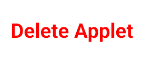

`DeleteModalProps` is an interface that defines the props that can be passed to the `DeleteModal`
component. Here's a breakdown of each prop:
* `id` : the id of the applet

```Typescript
interface DeleteModalProps {
    id: number;
}
```

The code defines a functional component called `DeleteModal` using TypeScript and React.
```Typescript
const DeleteModal: React.FC<DeleteModalProps> = ({ id })
```

The following code is using the `React.useState` hook to define and initialize state variables in
the `DeleteModal` component.

```Typescript
    const [modalVisible, setModalVisible] = useState<boolean>(false);
    const navigation: any = useNavigation();
```

The function `deleteApplet` is an asynchronous function that sets the modal visibility to false,
deletes an applet using the `DeleteApplet` function, and navigates to the "My Applets" screen.

```Typescript
    const deleteApplet = async () => {
        try {
            setModalVisible(false);
            await DeleteApplet(id);
            navigation.navigate('My Applets');
        } catch (error) {
            console.error(error);
        }
    };
```

The `return` statement in the code is returning the JSX (JavaScript XML) code that defines the
UI of the `DeleteModal` component.

```Typescript
return (
        <View style={styles.container}>
            <TouchableOpacity onPress={() => setModalVisible(true)}>
                <Text style={{...styles.text, fontWeight: 'bold', color: 'red' }}>Delete Applet</Text>
            </TouchableOpacity>
            <Modal
                transparent={true}
                visible={modalVisible}
                onRequestClose={() => {
                  setModalVisible(false);
                }}
            >
              <View style={styles.modalContainer}>
                <View style={styles.modalContent}>
                  <Text style={ styles.title }>Delete applet</Text>
                  <View style={{ flexDirection: 'column', justifyContent: 'space-between' }}>
                    <View>
                        <Text style={ styles.text }>Are you sure you want to delete this applet ?</Text>
                        <Text style={ styles.subtitles }>This action cannot be undone.</Text>
                    </View>
                    <View style={{ flexDirection: 'row', justifyContent: 'space-between', marginTop: 25 }}>
                        <Button title="Cancel" onPress={() => setModalVisible(false)} color="#363841" />
                        <Button title="Delete" onPress={deleteApplet} color="#363841" />
                    </View>
                  </View>
                </View>
              </View>
            </Modal>
        </View>
    );
```

The `const styles = StyleSheet.create({})` block is defining a JavaScript object that contains
styles for different elements in the component. The `StyleSheet.create()` function is used to create
a stylesheet object that optimizes the styles for performance.

```Typescript
const styles = StyleSheet.create({
    container: {
        flexDirection: 'row',
        justifyContent: 'space-between',
        alignItems: 'center',
    },
    title: {
        fontSize: 30,
        fontWeight: 'bold',
        marginBottom: 20,
        textAlign: 'center',
    },
    modalContainer: {
        flex: 1,
        justifyContent: 'center',
        alignItems: 'center',
        backgroundColor: 'rgba(0, 0, 0, 0.5)',
    },
    modalContent: {
        backgroundColor: 'white',
        padding: 20,
        borderRadius: 10,
        elevation: 5,
        width: '80%',
    },
    text: {
        fontSize: 22,
    },
    subtitles: {
        fontSize: 18,
        color: '#363841',
        marginTop: 10,
        fontWeight: 'bold',
    },
});
```

The line `export default DeleteModal;` is exporting the `DeleteModal` component as the default
export of the file. This allows other files to import and use the `DeleteModal` component by using
the `import` statement.

```Typescript
export default DeleteModal;
```
For more information about this file you can check his complete code here : [DeleteModal.tsx](https://github.com/maelbecel/ARea/blob/master/mobile/Area51/components/DeleteModal.tsx)

## [FormInput.tsx](https://github.com/maelbecel/ARea/blob/master/mobile/Area51/components/FormInput.tsx)

The `FormInput` component is the component that will be used to display the form for a text input in the mobile application.


The `interface InputProps` is defining the props that can be passed to the `FormInput` component.
It extends the `TouchableOpacityProps` interface, which means it inherits all the props from that
interface. Here's a breakdown of each prop:
* `label` : the label of the input
* `secure` : a boolean that indicates if the input is secure or not
* `inputMode` : the input mode of the input
* `icon` : the icon of the input
* `onChangeText` : a function that will be called when the text of the input changes
* `children` : the children of the input
* `size` : the size of the input

```Typescript
interface InputProps extends TouchableOpacityProps {
    title        : string;
    secure      ?: boolean;
    inputMode   ?: InputModeOptions;
    icon         : { name: string, width: number, height: number };
    onChangeText : (text: string) => void;
    children    ?: React.ReactNode;
    size        ?: DimensionValue;
}
```
The FormInput component is a reusable input field with an optional icon, title, secure text entry, input mode, and custom styling.

```Typescript
const FormInput: React.FC<InputProps> = ({ title, secure = false, inputMode, icon, onChangeText, children, size = '70%' })
```

The `return` statement is returning a JSX element that represents the structure and content of the
`FormInput` component.

```Typescript
return (
    <View style={[{width: size}, styles.container]}>
      <Icon name={icon.name} size={24} color="#00000080" />
      <TextInput
        style={styles.input}
        placeholder={title}
        placeholderTextColor={'#00000040'}
        maxLength={30}
        secureTextEntry={secure}
        inputMode={inputMode}
        onChangeText={onChangeText}
      />
      {children}
    </View>
  );
```

The `const styles = StyleSheet.create({})` block is creating a stylesheet object using the
`StyleSheet.create()` method provided by React Native. This allows you to define styles for your
components in a structured and optimized way.

```Typescript
const styles = StyleSheet.create({
  container: {
    marginVertical: 10,
    backgroundColor: '#D9D9D9',
    flexDirection: 'row',
    alignItems: 'center',
    paddingVertical: 5,
    paddingRight: 26,
    paddingLeft: 16,
    borderRadius: 8,
    borderWidth: 1,
    borderColor: '#E8E8E8',
  },
  input: {
    width: '80%',
    paddingLeft: 10,
    color: '#00000080',

    fontSize: 20,
    fontStyle: 'normal',
    fontWeight: '400',
  },
});
```

The `export default FormInput;` statement is exporting the `FormInput` component as the default
export of this module. This means that when another file imports this module, it can import the
`FormInput` component directly without having to specify its name. For example, in another file, you
can import the `FormInput` component like this: `import FormInput from './FormInput';`.

```Typescript
export default FormInput;
```

For more information about this file you can check his complete code here : [FormInput.tsx](https://github.com/maelbecel/ARea/blob/master/mobile/Area51/components/FormInput.tsx)


## [IngredientButton.tsx](https://github.com/maelbecel/ARea/blob/master/mobile/Area51/components/IngredientButton.tsx)

The `IngredientButton` is a component that is display when you want to display a text input with a button to add a placeholder in the mobile application.

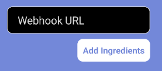

The `interface InputProps` is defining the props that can be passed to the `IngredientButton` component.
Here's a breakdown of each prop:
* `input` : the input of the text input
* `placeholders` : the placeholders of the text input
* `type` : the type of the text input
* `color` : the color of the text input
* `onSelect` : a function that will be called when the user select a placeholder
* `onChangeText` : a function that will be called when the text of the input changes


```Typescript
interface IngredientsProps {
    input : Input;
    placeholders : Dict;
    type : string;
    color : string;
    onSelect : (text: string) => void;
    onChangeText : (text: string) => void;
}
```

The `IngredientButton` component is a functional component that renders a view containing a text
input field and an optional dropdown menu.

```Typescript
const IngredientButton: React.FC<IngredientsProps>  = ({input, placeholders, type, color, onSelect, onChangeText})
```

The `React.useState` hook is used to define and initialize state variables in the `IngredientButton`
component.

```Typescript
    const [dropdownOpen, setDropdownOpen] = React.useState(false);
    const [value, setValue] = React.useState("");
```

The function "openDropdown" sets the state variable "dropdownOpen" to true.

```Typescript
    const openDropdown = () => {
        setDropdownOpen(true);
    }
```

The function "closeDropdown" sets the state variable "dropdownOpen" to false.

```Typescript
    const closeDropdown = () => {
        setDropdownOpen(false);
    }
```

The function `getPlaceHolder` takes a placeholder string as input and returns the corresponding
key from the `placeholders` object, or an empty string if no match is found.
The `placeholder` parameter is a string that represents the placeholder value
that you want to find the index of in the `placeholders` array.
The function `getPlaceHolder` returns the index of the placeholder in the `placeholders` array if it exists, otherwise it returns an empty string.

```Typescript
    const getPlaceHolder = (placeholder: string) => {
        for (let x in placeholders) {
            if (placeholders[x] == placeholder) {
                return x;
            }
        }
        return "";
    }
```

The function `displayPlaceHolders` returns an array of strings containing the values of the
`placeholders` object. The function `displayPlaceHolders` returns an array of strings.

```Typescript
    const displayPlaceHolders = () => {
        let array: string[] = [];
        for (let x in placeholders) {
            array.push(placeholders[x]);
        }
        return array;
    }
```

The `return` statement is returning a JSX element that represents the structure and content of
the `IngredientButton` component.

```Typescript
    return (
      <View key={input.name} style={{marginVertical : 10, width:"100%"}}>
        <View >
          <TextInput value={value} placeholder={input.label} multiline={true} textBreakStrategy="highQuality" placeholderTextColor={getWriteColor(color, true)} onChangeText={(text) => {onChangeText(text); setValue(text)}} style={[styles.input, { backgroundColor: getWriteColor(getWriteColor(color, true)), color: getWriteColor(color, true) }]}/>
        </View>
        {(type == "reaction") ? <View style={{alignSelf: "flex-end", marginRight : "15%"}} >
          {(!dropdownOpen) ? (
          <TouchableOpacity style={[{backgroundColor: getWriteColor(color)}, styles.ingredients]} onPress={openDropdown}>
            <Text style={[{color: color}, styles.buttoningr]}>Add Ingredients</Text>
          </TouchableOpacity>)
          : (
            <View style={[{backgroundColor: getWriteColor(color)}, styles.option]} >
                <SelectDropdown data={displayPlaceHolders()} onSelect={(text) => {onSelect(text); setValue(value + "{" + getPlaceHolder(text) + "}"); closeDropdown()}} buttonTextStyle={[{color: color}, styles.buttoningr]} buttonStyle={[{backgroundColor: 'transparent', margin: -5}]}/>
            </View>
          )}
        </View> : null}
     </View>
    )
```

The `const styles` object is defining a set of styles using the `StyleSheet.create` method from the
`react-native` library. Each key-value pair in the `styles` object represents a specific style rule.

```Typescript
const styles = StyleSheet.create({
    logo: {
      height: 100,
      marginTop: 10,
      width: 100,
      alignSelf: 'center',
    },
    button : {
        marginVertical: 10,
        width: '50%',
        padding: 5,
        borderRadius: 10,
        marginBottom: 30,
    },
    ingredients : {
      padding: 5,
      marginVertical: 10,
      width: '50%',
      borderRadius: 10,
      marginBottom: 30,
    },
    option : {
        marginVertical: 10,
        width: 'auto',
        borderRadius: 10,
        marginBottom: 30,
      },
    buttoningr: {
      fontSize: 16,
      fontWeight: 'bold',
      alignSelf: 'center',
      padding: 5,
    },
    buttonText: {
      fontSize: 20,
      fontWeight: 'bold',
      alignSelf: 'center',
      padding: 5,
    },
    container: {
      paddingTop: 30,
    },
    name: {
      fontSize: 30,
      fontWeight: 'bold',
      alignSelf: 'center',
      marginBottom: 40,
    },
    desc: {
      fontSize: 20,
      alignSelf: 'center',
      width: '70%',
      textAlign: 'center',
      marginBottom: 40,
    },
    input: {
      fontSize: 20,
      alignSelf: 'center',
      borderColor: '#D9D9D9',
      borderWidth: 1,
      width: '70%',
      borderRadius: 10,
      paddingLeft: 20,
      paddingRight: 20,
      paddingVertical: 10,
      flexWrap: 'wrap',
    },
    action: {
      paddingTop: 50,
      alignContent: "center",
      alignItems: "center",
      height: "100%",
    }
  });
```

The line `export default IngredientButton;` is exporting the `IngredientButton` component as the
default export of the module. This means that when another file imports this module, it can access
the `IngredientButton` component directly without having to specify its name in curly braces. For
example, in another file, you can import the `IngredientButton` component like this: `import
IngredientButton from './IngredientButton'`.

```Typescript
export default IngredientButton;
```

For more information about this file you can check his complete code here : [IngredientButton.tsx](https://github.com/maelbecel/ARea/blob/master/mobile/Area51/components/IngredientButton.tsx)


## [OutlinedTextBox.tsx](https://github.com/maelbecel/ARea/blob/master/mobile/Area51/components/OutlinedTextBox.tsx)

The `OutlinedTextBox` component is the component that will be used to display the form for a text input in the mobile application.

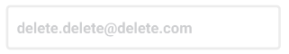

The `interface OutlinedTextBoxProps` defines the props that can be passed to the `OutlinedTextBox`
component. Here's a breakdown of each prop:
* `onChangeText` : a function that will be called when the text of the input changes
* `value` : the value of the input
* `secureTextEntry` : a boolean that indicates if the input is secure or not

```Typescript
interface OutlinedTextBoxProps {
  onChangeText : (text: string) => void;
  value: string;
  secureTextEntry?: boolean;
}
```

The above code defines a React functional component called OutlinedTextBox that renders a text input
field with an outline, and updates its focus state based on user interaction.

```Typescript
const OutlinedTextBox: React.FC<OutlinedTextBoxProps> = ({onChangeText, value, secureTextEntry})
```

The `React.useState` hook is used to define and initialize state variables in the `OutlinedTextBox`
component.

```Typescript
    const [isFocused, setIsFocused] = React.useState(false);
```

The handleFocus function sets the state variable isFocused to true.

```Typescript
        const handleFocus = () => setIsFocused(true);
```

The handleBlur function sets the state variable isFocused to false.

```Typescript
        const handleBlur = () => setIsFocused(false);
```

The `return` statement in the `OutlinedTextBox` component is rendering the JSX code that will be
displayed on the screen.

```Typescript
return (
    <View style={[styles.container, isFocused ? null : styles.focused]}>
      <TextInput
        onChangeText={onChangeText}
        onFocus={handleFocus}
        onBlur={handleBlur}
        style={[styles.textInput, isFocused ? null : styles.focused]} // Si isFocused est vrai, on ne met pas de style, sinon on met le style [styles.focused
        value={value}
      />
    </View>
  );
```

The `const styles` variable is an object that contains style definitions for different elements in
the `OutlinedTextBox` component. It uses the `StyleSheet.create` method from the `react-native`
library to create a stylesheet with optimized performance.

```Typescript
const styles = StyleSheet.create({
  container: {
    borderWidth: 3, // Largeur de la bordure
    borderColor: '#363841', // Couleur de la bordure
    borderRadius: 5, // Rayon des coins de la boîte
    paddingVertical: 10, // Rembourrage vertical pour l'espace interne
    paddingHorizontal: 10, // Rembourrage horizontal pour l'espace interne
    marginVertical: 10, // Marge verticale pour l'espace externe
  },
  textInput: {
    width: '100%', // Largeur de la boîte
    fontSize: 18, // Taille de la police
    fontWeight: 'bold', // Texte en gras
    color: '#363841', // Couleur du texte
  },
  focused: {
    borderColor: '#D9D9D9', // Couleur de la bordure
    color: '#363841', // Couleur du texte
    opacity: 0.5, // Opacité du texte
  },
});
```

The `export default OutlinedTextBox;` statement is exporting the `OutlinedTextBox` component as the
default export of this module. This means that when another file imports this module, it can import
the `OutlinedTextBox` component directly without having to specify its name in curly braces. For
example, in another file, you can import the `OutlinedTextBox` component like this: `import
OutlinedTextBox from './OutlinedTextBox'`.

```Typescript
export default OutlinedTextBox;
```

For more information about this file you can check his complete code here : [OutlinedTextBox.tsx](https://github.com/maelbecel/ARea/blob/master/mobile/Area51/components/OutlinedTextBox.tsx)


## [OutlinedTitleBox.tsx](https://github.com/maelbecel/ARea/blob/master/mobile/Area51/components/OutlinedTitleBox.tsx)

The `OutlinedTitleBox` component is the component that will be used to display the form for a text input in the mobile application.

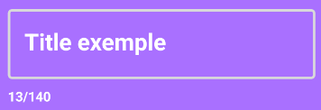

The `interface OutlinedTitleBoxProps` defines the props that can be passed to the `OutlinedTitleBox`
component. Here's a breakdown of each prop:
* `onChangeText` : a function that will be called when the text of the input changes
* `value` : the value of the input
* `bgColor` : the background color of the input
* `author` : the author of the input

```Typescript
interface OutlinedTitleBoxProps {
  onChangeText : (text: string) => void;
  value: string;
  bgColor: string;
  author?: string;
}
```

The above code defines a React functional component called OutlinedTitleBox that renders a text input
field with an outline, and updates its focus state based on user interaction.
```Typescript
const OutlinedTitleBox: React.FC<OutlinedTitleBoxProps> = ({onChangeText, value, bgColor, author})
```

The `React.useState` hook is used to define and initialize state variables in the `OutlinedTitleBox`
component.

```Typescript
    const [isFocused, setIsFocused] = React.useState(false);
```

The handleFocus function sets the state variable isFocused to true.

```Typescript
        const handleFocus = () => setIsFocused(true);
```

The handleBlur function sets the state variable isFocused to false.

```Typescript
const handleBlur = async () => {
    setIsFocused(false);
    const appletID = await AsyncStorage.getItem('appletID');
    await UpdateAppletTitleWithID(appletID, value);
  };
```

The function `titleLen` returns the length of a given value as a string, followed by "/140", or an
empty string if the value is undefined.

```Typescript
  const titleLen = () => {
      if (value.length >= 0) {
          return `${value.length}/140`;
      }
      return "";
  };
```

The `return` statement in the `OutlinedTitleBox` component is rendering the JSX code that will be
displayed on the screen. There is two case :

* If the component is focused, it will display the text input with the value, the background color and the author.

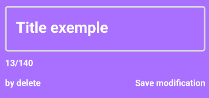

```Typescript
    <View>
        <View style={[styles.container, styles.focused]}>
            <TextInput
                onChangeText={onChangeText}
                onFocus={handleFocus}
                onBlur={handleBlur}
                style={[styles.textInput, styles.focused, { color: getWriteColor(bgColor)}]} // Si isFocused est vrai, on ne met pas de style, sinon on met le style [styles.focused
                value={value}
                multiline={true}
            />
        </View>
        <Text style={{ fontSize: 16, fontWeight: 'bold', color: getWriteColor(bgColor), marginBottom: 15 }}>{titleLen()}</Text>
    {/* The user who created the applet and the button to edit the title */}
        <View style={{ flexDirection: 'row', justifyContent: 'space-between' }}>
            <Text style={{ fontSize: 16, fontWeight: 'bold', color: getWriteColor(bgColor) }}>by {author}</Text>
            <TouchableOpacity onPress={handleBlur}>
                <Text style={{ fontSize: 16, fontWeight: 'bold', color: getWriteColor(bgColor) }}>Save modification</Text>
            </TouchableOpacity>
        </View>
    </View>
```

* Otherwise, it will display the text input with the value, the background color and the author.


```Typescript
    <View>
        <Text style={ [styles.textInput, {color: getWriteColor(bgColor) }]}>{value}</Text>
        <View style={{ flexDirection: 'row', justifyContent: 'space-between' }}>
            <Text style={{ fontSize: 16, fontWeight: 'bold', color: getWriteColor(bgColor) }}>by {author}</Text>
            <TouchableOpacity onPress={handleFocus}>
                <Text style={{ fontSize: 16, fontWeight: 'bold', color: getWriteColor(bgColor) }}>Edit title</Text>
            </TouchableOpacity>
        </View>
    </View>
```

The `const styles` object is defining a set of styles using the `StyleSheet.create` method from the
`react-native` library. These styles are then used to style the components in the `OutlinedTitleBox`
component.

```Typescript
const styles = StyleSheet.create({
  container: {
    borderWidth: 3, // Largeur de la bordure
    borderColor: '#363841', // Couleur de la bordure
    borderRadius: 5, // Rayon des coins de la boîte
    paddingVertical: 10, // Rembourrage vertical pour l'espace interne
    paddingHorizontal: 10, // Rembourrage horizontal pour l'espace interne
    marginVertical: 10, // Marge verticale pour l'espace externe
  },
  textInput: {
    fontSize: 28, // Taille de la police
    fontWeight: 'bold', // Texte en gras
    paddingVertical: '2%',
    paddingHorizontal: '2%',
    marginBottom: '2%',
  },
  focused: {
    borderColor: '#D9D9D9', // Couleur de la bordure
  },
});
```

The line `export default OutlinedTitleBox;` is exporting the `OutlinedTitleBox` component as the
default export of the file. This means that when another file imports this module, it can import the
`OutlinedTitleBox` component using any name of its choice. For example, in another file, you can
import the `OutlinedTitleBox` component like this:

```Typescript
import OutlinedTitleBox from './OutlinedTitleBox';
```

For more information about this file you can check his complete code here : [OutlinedTitleBox.tsx](https://github.com/maelbecel/ARea/blob/master/mobile/Area51/components/OutlinedTitleBox.tsx)


## [PasswordModal.tsx](https://github.com/maelbecel/ARea/blob/master/mobile/Area51/components/PasswordModal.tsx)

The `PasswordModal` component is the component that will be used to display the password modal in the mobile application.

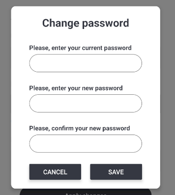

The code defines a functional component called `PasswordModal` using TypeScript and React. 

```Typescript
const PasswordModal: React.FC = ()
```

The following code is using the `React.useState` hook to define and initialize state variables in
the `PasswordModal` component.

```Typescript
    const [password, setPassword] = useState('');
    const [modalVisible, setModalVisible] = useState(false);
    const [currentPassword, setCurrentPassword] = useState('');
    const [confirmPassword, setConfirmPassword] = useState('');
```
The function saves the server address in local storage and checks if the server is reachable.

```Typescript
 const savePassword = async () => {
        // Enregistrez l'adresse du serveur dans le stockage local
        try {
          if (password !== confirmPassword) {
            alert('Passwords do not match');
            return;
          }
          const res = await PatchUser(null, password, currentPassword, null);
          if (res.status === 400) {
            alert('Wrong current password');
            return;
          }
          setModalVisible(false);
          setPassword('');
          setCurrentPassword('');
        } catch (error) {
          alert('Error while saving password');
        }
    };
```

The function "reset" resets the state variables for a modal, password, current password, and
confirm password.

```Typescript
    const reset = () => {
      setModalVisible(false);
      setPassword('');
      setCurrentPassword('');
      setConfirmPassword('');
    };
```

The `return` statement in the code is returning the JSX (JavaScript XML) code that defines the
UI of the `ServerModal` component.

```Typescript
return (
        <View>
            {/* <StatusBar backgroundColor={modalVisible ? 'rgba(0, 0, 0, 0.5)' : 'rgba(0, 0, 0, 0.0)'}/> */}
            <TouchableOpacity onPress={() => setModalVisible(true)}>
              <Text style={styles.link}>Change password</Text>
            </TouchableOpacity>
            <Modal
                transparent={true}
                visible={modalVisible}
                onRequestClose={() => {
                  setModalVisible(false);
                }}
            >
              <View style={styles.modalContainer}>
                <View style={styles.modalContent}>
                  <Text style={ styles.title }>Change password</Text>
                  <Text style={ styles.text }>Please, enter your current password</Text>
                  <TextInput
                    style={styles.input}
                    value={currentPassword}
                    secureTextEntry={true}
                    onChangeText={(text) => setCurrentPassword(text)}
                  />
                  <Text style={ styles.text }>Please, enter your new password</Text>
                  <TextInput
                    style={styles.input}
                    value={password}
                    secureTextEntry={true}
                    onChangeText={(text) => setPassword(text)}
                  />
                  <Text style={ styles.text }>Please, confirm your new password</Text>
                  <TextInput
                    style={styles.input}
                    value={confirmPassword}
                    secureTextEntry={true}
                    onChangeText={(text) => setConfirmPassword(text)}
                  />
                  <View style={{ justifyContent: 'space-between', flexDirection: 'row' }}>
                    <View style={{ flex: 1, marginRight: 10 }}>
                    <Button title="Cancel" onPress={() => reset()} color="#363841" />
                    </View>
                    <View style={{ flex: 1, marginLeft: 10 }}>
                    <Button title="Save" onPress={savePassword} color="#363841" />
                    </View>
                  </View>
                </View>
              </View>
            </Modal>
        </View>
    );
```

The `const styles = StyleSheet.create({})` block is defining a JavaScript object that contains
styles for different elements in the component. The `StyleSheet.create()` function is used to create
a stylesheet object that optimizes the styles for performance.

```Typescript
const styles = StyleSheet.create({
    modalContainer: {
        flex: 1,
        justifyContent: 'center',
        alignItems: 'center',
        backgroundColor: 'rgba(0, 0, 0, 0.5)',
    },
    modalContent: {
        backgroundColor: 'white',
        width: '80%',
        paddingHorizontal: 40,
        paddingVertical: 20,
        height: 'auto',
        borderRadius: 10,
        elevation: 5,
    },
    link: {
      color: '#00C2FF',
      textAlign: 'left',
      fontWeight: 'bold',
      marginBottom: 10,
      fontSize: 14
    },
    input: {
      height: 40,
      borderColor: 'gray',
      borderWidth: 1,
      paddingHorizontal: 10,
      borderRadius: 20,
      marginBottom: 25,
    },
    title: {
      fontSize: 24,
      color: '#363841',
      fontWeight: 'bold',
      marginBottom: 30,
      textAlign: 'center',
    },
    text: {
      color: '#363841',
      fontSize: 14,
      marginBottom: 5,
      fontWeight: 'bold',
    },
});
```

The line `export default PasswordModal;` is exporting the `PasswordModal` component as the default
export of the file. This means that when another file imports this module, it can import the
`PasswordModal` component using any name of its choice. For example, in another file, you can
import the `PasswordModal` component like this:

```Typescript
import PasswordModal from './PasswordModal';
```

For more information about this file you can check his complete code here : [PasswordModal.tsx](https://github.com/maelbecel/ARea/blob/master/mobile/Area51/components/PasswordModal.tsx)


## [ProfileForm.tsx](https://github.com/maelbecel/ARea/blob/master/mobile/Area51/components/ProfileForm.tsx)

The `ProfileForm` component is the component that will be used to display the form for the profile page.

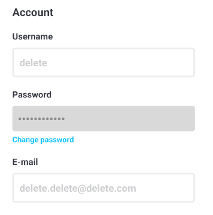

The `interface ProfileFormProps` defines the props that can be passed to the `ProfileForm`
component. Here's a breakdown of each prop:
* `data` : the data of the user

```Typescript
interface ProfileFormProps {
  data: any;
}
```

The secureText function replaces each character in a string with an asterisk (*) to hide sensitive
information like passwords. The `passwordLength` parameter is a number that represents the
length of the password.

```Typescript
const secureText = (passwordLength: number) => {
    return '•'.repeat(passwordLength); // Remplace chaque caractère par un astérisque (*)
};
```

The SecureText component displays a secure text value based on the provided password length.
The `SecureText` component takes in a `passwordLength` parameter, which is used as an
argument for the `secureText` function. The `secureText` function is not defined in the code snippet
provided, so it is unclear what it does. However, the result of the `secure

```Typescript
const SecureText = ({ passwordLength }) => {
    const secureTextValue = secureText(passwordLength);

    return (
      <Text style={styles.secureText}>{secureTextValue}</Text>
    );
};
```
The `ProfileForm` component is a functional component that displays a form for editing user profile
information.

```Typescript
const ProfileForm: React.FC<ProfileFormProps> = ({ data })
```

The `React.useState` hook is used to define and initialize state variables in the `ProfileForm`
component.

```Typescript
    const [username, setUsername] = useState<string>('');
    const [password, setPassword] = useState<string>('password');
    const [email, setEmail] = useState<string>('');
```

The `useEffect` hook in the `ProfileForm` component is used to fetch data from AsyncStorage and
update the component's state with the retrieved data.

```Typescript
    useEffect(() => {
        const dataFetch = async () => {
            const username = await AsyncStorage.getItem('username');
            const email = await AsyncStorage.getItem('email');
            setUsername(username);
            setEmail(email);
        };
        dataFetch();
    }, []);
```

The function `handleUsernameChange` updates the username state and saves it to AsyncStorage.
The `text` parameter is a string that represents the new username value
that needs to be saved.

```Typescript
    const handleUsernameChange = async (text: string) => {
        setUsername(text);
        await AsyncStorage.setItem('username', text);
    };
```

The function `handlePasswordChange` is used to update the password state in a React component.
The `text` parameter is a string that represents the new password value.

```Typescript
    const handlePasswordChange = async (text: string) => {
        setPassword(text);
    };
```

The function `handleEmailChange` updates the email state and saves it to AsyncStorage.
The `text` parameter is a string that represents the new email address
that needs to be updated.

```Typescript
    const handleEmailChange = async (text: string) => {
        setEmail(text);
        await AsyncStorage.setItem('email', text);
    };
```

The `return` statement in the `ProfileForm` component is rendering the JSX code that represents
the form for editing user profile information. It will not display the password form if the user account has been created by a service

```Typescript
return (
        <View style={styles.userInfo}>
            <View style={{marginBottom: 10}}>
                <Text style={styles.title}>Account</Text>
            </View>
            <View style={{marginTop: 10}}>
                <Text style={styles.subtitle}>Username</Text>
                <OutlinedTextBox
                onChangeText={handleUsernameChange}
                value={username}
                />
            </View>
            {(data.loginWithService == false) ? (
            <View style={{marginTop: 10}}>
                <Text style={styles.subtitle}>Password</Text>
                <View style={styles.rectangle}>
                    <SecureText passwordLength={data.passwordLength} />
                </View>
                <PasswordModal/>
            </View>) : null}
            <View style={{marginTop: 10}}>
                <Text style={styles.subtitle}>E-mail</Text>
                <OutlinedTextBox
                    onChangeText={handleEmailChange}
                    value={email}
                />
            </View>
        </View>
    );
```

The `const styles` object is defining a set of styles using the `StyleSheet.create` method from
React Native. Each key-value pair in the `styles` object represents a specific style that can be
applied to a component in the `ProfileForm` component.

```Typescript
const styles = StyleSheet.create({
    userInfo: {
        marginHorizontal: 10, // Marge à gauche de l'avatar pour l'espace entre l'image et le texte
    },
    title: {
        fontSize: 20, // Taille de la police pour le titre
        fontWeight: 'bold', // Texte en gras pour le titre
        color: '#363841',
    },
    subtitle: {
        fontSize: 16, // Taille de la police pour le nom d'utilisateur
        fontWeight: 'bold', // Texte en gras pour le nom d'utilisateur
        color: '#363841',
    },
    link: {
        color: '#00C2FF',
        textAlign: 'left',
        fontWeight: 'bold',
        marginBottom: 10,
    },
    secureText: {
        fontSize: 20,
        fontWeight: 'bold',
        color: '#363841',
        opacity: 0.5,
    },
    rectangle: {
        backgroundColor: '#D9D9D9', // Couleur de la boîte
        borderRadius: 5, // Rayon des coins de la boîte
        paddingVertical: 10, // Rembourrage vertical pour l'espace interne
        paddingHorizontal: 10, // Rembourrage horizontal pour l'espace interne
        marginTop: 10, // Marge verticale pour l'espace externe
        marginBottom: 5, // Marge verticale pour l'espace externe
    },
});
```

The line `export default ProfileForm;` is exporting the `ProfileForm` component as the default
export of the file. This means that when another file imports this module, it can import the
`ProfileForm` component using any name of its choice. For example, in another file, you can
import the `ProfileForm` component like this:

```Typescript
import ProfileForm from './ProfileForm';
```

For more information about this file you can check his complete code here : [ProfileForm.tsx](https://github.com/maelbecel/ARea/blob/master/mobile/Area51/components/ProfileForm.tsx)

## [ServerModal.tsx](https://github.com/maelbecel/ARea/blob/master/mobile/Area51/components/ServerModal.tsx)

The `ServerModal` component is the component that will be used to display the server modal in the mobile application.
It will allow the user to choose the server address where the application will be connected.

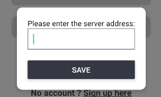

The code defines a functional component called `ServerModal` using TypeScript and React.

```Typescript
const ServerModal: React.FC = ()
```

The following code is using the `React.useState` hook to define and initialize state variables in
component.

```Typescript
    const [serverAddress, setServerAddress] = useState('');
    const [modalVisible, setModalVisible] = useState(false);
```

he `useEffect` hook is used to perform side effects in functional components. In this code, the
`useEffect` hook is used to check if the server address is already saved in the local storage.

```Typescript
    useEffect(() => {
      const checkAndShowModal = async () => {
        try {
          const savedAddress = await AsyncStorage.getItem('serverAddress');
          if (!savedAddress) {
            // Si l'adresse du serveur n'est pas enregistrée, ouvrez le modal
            setModalVisible(true);
          } else {
            setServerAddress(savedAddress);
          }
        } catch (error) {
          console.error('Erreur lors de la récupération de l\'adresse du serveur :', error);
        }
      };
      checkAndShowModal();
    }, []); 
```

The function saves the server address in local storage and checks if the server is reachable.
```Typescript
    const saveServerAddress = async () => {
        // Enregistrez l'adresse du serveur dans le stockage local
        // use this regex ^((?!-)[A-Za-z0-9-]{1,63}(?<!-).)+[A-Za-z]{2,6}$
        if (!serverAddress.match(/^(http:\/\/|https:\/\/)?([a-zA-Z0-9][a-zA-Z0-9_-]*(\.[a-zA-Z0-9_-]*)+)(\/.*)?$/)) {
          Alert.alert(
            'Warning',
            'The server is not on a valid domain name. Therefore, the application may not function properly. By clicking OK, you agree to use the application at your own risk.',
            [
              {
                text: 'Cancel',
                onPress: () => {
                  return;
                },
                style: 'cancel',
              },
              {
                text: 'OK',
                onPress: async () => {
                  try {
                    await fetch(`${serverAddress}/about.json`);

                    await AsyncStorage.setItem('serverAddress', serverAddress);
                    await AsyncStorage.setItem('serverAddressWarning', 'false');
                    setModalVisible(false);
                  } catch (error) {
                    Alert.alert('Error', 'Unable to connect to the server. Please check the server address.');
                  }
                },
              },
            ],
            { cancelable: false }
          );
        } else {
          try {
            await fetch(`${serverAddress}/about.json`);

            await AsyncStorage.setItem('serverAddress', serverAddress);
            await AsyncStorage.setItem('serverAddressWarning', 'true');
            setModalVisible(false);
          } catch (error) {
            Alert.alert('Error', 'Unable to connect to the server. Please check the server address.');
          }
          return;
        }
    };
```

The `return` statement in the code is returning the JSX (JavaScript XML) code that defines the
UI of the `ServerModal` component.

```Typescript
    return (
        <View style={styles.container}>
            {/* <StatusBar backgroundColor={modalVisible ? 'rgba(0, 0, 0, 0.5)' : 'rgba(0, 0, 0, 0.0)'}/> */}
            <TouchableOpacity style={styles.settingsButton} onPress={() => setModalVisible(true)}>
                <MaterialIcons name="settings" size={50} color="#363841" />
            </TouchableOpacity>
            <Modal
                transparent={true}
                visible={modalVisible}
                onRequestClose={() => {
                  setModalVisible(false);
                }}
            >
              <View style={styles.modalContainer}>
                <View style={styles.modalContent}>
                  <Text style={{ marginBottom: 10 }}>Please enter the server address:</Text>
                  <TextInput
                    style={styles.input}
                    value={serverAddress}
                    onChangeText={(text) => setServerAddress(text)}
                  />
                  <Button title="Save" onPress={saveServerAddress} color="#363841" />
                </View>
              </View>
            </Modal>
        </View>
    );
```

The `const styles = StyleSheet.create({})` block is defining a JavaScript object that contains
styles for different elements in the component. The `StyleSheet.create()` function is used to create
a stylesheet object that optimizes the styles for performance.

```Typescript
const styles = StyleSheet.create({
    container: {
        position: 'absolute',
        marginTop: 20,
        marginLeft: 20,
    },
    modalContainer: {
        flex: 1,
        justifyContent: 'center',
        alignItems: 'center',
        backgroundColor: 'rgba(0, 0, 0, 0.5)',
    },
    modalContent: {
        backgroundColor: 'white',
        padding: 20,
        borderRadius: 10,
        elevation: 5,
    },
    input: {
      height: 40,
      borderColor: 'gray',
      borderWidth: 1,
      marginBottom: 20,
      paddingHorizontal: 10,
    },
    settingsButton: {
    },
});
```

The line `export default ServerModal;` is exporting the `ServerModal` component as the default
export of the file. This means that when another file imports this module, it can import the
`ServerModal` component using any name of its choice. For example, in another file, you can
import the `ServerModal` component like this:

```Typescript
import ServerModal from './ServerModal';
```

For more information about this file you can check his complete code here : [ServerModal.tsx](https://github.com/maelbecel/ARea/blob/master/mobile/Area51/components/ServerModal.tsx)

## [ServiceCard.tsx](https://github.com/maelbecel/ARea/blob/master/mobile/Area51/components/ServiceCard.tsx)

The `ServiceCard` component is the component that will be used to display the service card in the mobile application.


The `interface CardProps` is defining a new interface called `CardProps` that extends the
`TouchableOpacityProps` interface. It specifies the expected props for the `ServiceCard` component. Here's a breakdown of each prop:
* `title` : the title of the service
* `logo` : the logo of the service
* `color` : the color of the service
* `slug` : the slug of the service
* `onPress` : a function that will be called when the card is pressed

```Typescript
interface CardProps extends TouchableOpacityProps {
    title   : string;
    logo    : string;
    color   : string;
    slug    : string;
    onPress: () => void;
}
```

The `ServiceCard` component is a functional component that displays a card for a service.

```Typescript
const ServiceCard: React.FC<CardProps> = ({ title, logo, color, slug, onPress })
```

We start by handling the case there is no color for the service.

```Typescript
    if (color === '') {
        color = '#EEEEEE';
    }
```

Then we handle the case there is no logo for the service.

```Typescript
    if (logo === '') {
        logo = 'https://via.placeholder.com/70';
    }
```

The `return` statement in the `ServiceCard` component is rendering the JSX code that represents
the card for a service.

```Typescript
    return (
        <TouchableOpacity onPress={onPress} style={[{backgroundColor: color}, styles.container]}>
                <Image source={{ uri: logo, cache: 'force-cache' }} style={styles.logo}/>
            <View>
                <Text style={[styles.name, {color: getWriteColor(color)}]}>{title}</Text>
            </View>
        </TouchableOpacity>
  );
```

The `const styles = StyleSheet.create({ ... })` block is defining a JavaScript object called
`styles` that contains various style properties for the `ServiceCard` component. Each property in
the `styles` object represents a different style rule, such as `container`, `logo`, and `name`.
These style rules define the visual appearance of the `ServiceCard` component.

```Typescript
const styles = StyleSheet.create({
    container: {
      paddingTop: 30,
      marginVertical: 15,
      width: '85%',
      borderRadius: 10,
      shadowColor: '#000',
        shadowOffset: {
        width: 0,
        height: 2,
        },
        shadowOpacity: 0.3,
        shadowRadius: 3.84,
        elevation: 5,
    },
    logo: {
        height: 70,
        width: 70,
        marginVertical: 10,
        alignSelf: 'center',
    },
    name: {
      fontSize: 20,
      fontWeight: 'bold',
      alignSelf: 'center',
      marginTop: 5,
      marginBottom: 20,
    },
  });
```

The line `export default ServiceCard;` is exporting the `ServiceCard` component as the default
export of the module. This means that when another file imports this module, it can import the
`ServiceCard` component using the default import syntax, like `import ServiceCard from
'./ServiceCard'`.

```Typescript
export default ServiceCard;
```

For more information about this file you can check his complete code here : [ServiceCard.tsx](https://github.com/maelbecel/ARea/blob/master/mobile/Area51/components/ServiceCard.tsx)


## [ServiceLogo.tsx](https://github.com/maelbecel/ARea/blob/master/mobile/Area51/components/ServiceLogo.tsx)

The `ServiceLogo` component is the component that will be used to display the service logo in the mobile application.


The `interface CardProps` is defining the props that can be passed to the `ServiceLogo` component.
It extends the `TouchableOpacityProps` interface, which includes all the props that can be passed to
the `TouchableOpacity` component from the `react-native` library.
Here is a breakdown of each prop:


```Typescript
interface CardProps extends TouchableOpacityProps {
    slug    : string;
    onPress : () => void;
    disabled ?: boolean;
}
```

The `ServiceLogo` component is a functional component that displays a logo for a service.

```Typescript
const ServiceLogo: React.FC<CardProps> = ({ slug , onPress, disabled = false})
```

The `ServiceLogo` uses the `useState` hook to define and initialize state variables in the
`ServiceLogo` component.

```Typescript
    const [color, setColor] = React.useState<string>("EEEEEE");
    const [logo, setLogo] = React.useState<string>("https://via.placeholder.com/50");
    const [loading, setLoading] = React.useState<boolean>(true);
```

The `React.useEffect` hook is used to perform side effects in functional components. In this
case, it is used to fetch information about a service and update the state variables `color`,
`logo`, and `loading` based on the fetched data.

```Typescript
    React.useEffect(() => {
        const fetchInfos = async () => {
            const res = await ServiceInfo(slug);
            setColor(res.decoration.backgroundColor);
            setLogo(res.decoration.logoUrl);
            setLoading(false);
        }
        fetchInfos();
    }, []);
```

Then we can render the component if `loading` is false.

We have two cases :

* If the component is not disabled, we render the logo with the color and the logo of the service and write _Log Out_.

 

```Typescript
                <TouchableOpacity onPress={onPress} style={[{backgroundColor: color}, styles.container]}>
                    <View>
                        <Image source={{ uri: logo, cache: 'force-cache' }} style={styles.logopti}/>
                        <Text style={{color : getWriteColor(color), fontWeight : 'bold', fontSize : 9.9, alignSelf : 'center'}}>Log Out</Text>
                    </View>
                </TouchableOpacity>
```

* If the component is disabled, we render the logo with the color and the logo of the service and write _Log In_.


```Typescript
                <TouchableOpacity onPress={onPress} style={[{backgroundColor: color}, styles.container]}>
                    <View>
                        <Image source={{ uri: logo, cache: 'force-cache' }} style={[styles.logopti]}/>
                        <Text style={{color : getWriteColor(color), fontWeight : 'bold', fontSize : 13, alignSelf : 'center'}}>Log In</Text>
                    </View>
                </TouchableOpacity>
```

The `const styles` object is defining a set of styles using the `StyleSheet.create` method from the
`react-native` library. This method ensures that the styles are optimized for performance.

```Typescript
const styles = StyleSheet.create({
    container: {
      height: 80,
      width: 80,
      marginVertical: 15,
      marginRight: 15,
      paddingHorizontal: 20,
      borderRadius: 10,
      shadowColor: '#000',
        shadowOffset: {
        width: 0,
        height: 2,
        },
        shadowOpacity: 0.3,
        shadowRadius: 3.84,
        elevation: 5,
    },
    logo: {
        height: 50,
        width: 50,
        marginVertical: 15,
        alignSelf: 'center',
    },
    logopti: {
        height: 30,
        width: 30,
        marginVertical: 15,
        alignSelf: 'center',
    }
});
```

The line `export default ServiceLogo;` is exporting the `ServiceLogo` component as the default
export of the file. This means that when another file imports this module, it can import the
`ServiceLogo` component using any name of its choice. For example, in another file, you can
import the `ServiceLogo` component like this:

```Typescript
import ServiceLogo from './ServiceLogo';
```

For more information about this file you can check his complete code here : [ServiceLogo.tsx](https://github.com/maelbecel/ARea/blob/master/mobile/Area51/components/ServiceLogo.tsx)

## [SubmitButton.tsx](https://github.com/maelbecel/ARea/blob/master/mobile/Area51/components/SubmitButton.tsx)

The `SubmitButton` component is the component that will be used to display the submit button in the mobile application.


The `interface InputProps` is defining the props that can be passed to the `FormInput` component.
It extends the `TouchableOpacityProps` interface, which means it inherits all the props from that
interface. Here is a breakdown of each prop:
* `title` : the title of the button
* `icon` : the icon of the button
* `textcolor` : the color of the text
* `onPress` : a function that will be called when the button is pressed

```Typescript
interface SubmitButtonProps extends TouchableOpacityProps {
    title        : string;
    icon        ?: { uri: any, width: number, height: number };
    textcolor   ?: string;
    onPress     ?: () => void;
}
```

The `SubmitButton` component is a functional component that displays a button for a service.

```Typescript
const SubmitButton: React.FC<SubmitButtonProps> = ({ title, icon, textcolor = '#363841', onPress })
```

It has two possible return :

* If the icon is not defined, we return a button with the title and the color of the text.


```Typescript
            <TouchableOpacity style={styles.containerimg} onPress={onPress}>
                <Text style={[{color: textcolor}, styles.title]}>{title}</Text>
                <Image source={icon.uri} style={{ width: icon.width, height: icon.height, marginLeft: 10 }} />
            </TouchableOpacity>
```

* If the icon is defined, we return a button with the title, the color of the text and the icon.


```Typescript
            <TouchableOpacity style={styles.container} onPress={onPress}>
                <Text style={[{color: textcolor}, styles.title]}>{title}</Text>
            </TouchableOpacity>
```

The `const styles = StyleSheet.create({ ... })` block is creating a JavaScript object that contains
styles for different components in the `SubmitButton` component. Each key-value pair in the object
represents a style property and its corresponding value.

```Typescript
const styles = StyleSheet.create({
    container: {
        marginVertical: 10,
        alignItems: 'center',
        width: '40%',
        padding: 10,
        backgroundColor: '#363841',
        borderRadius: 90,
        marginTop: 20,
    },
    containerimg: {
        justifyContent: 'center',
        alignItems: 'center',
        marginVertical: 10,
        flexDirection: 'row',
        width: '65%',
        paddingVertical: 18,
        paddingHorizontal: 20,
        backgroundColor: '#363841',
        borderRadius: 90,
    },
    title: {
        fontSize: 20,
        fontStyle: 'normal',
        fontWeight: "700",
    }
});
```

The line `export default SubmitButton;` is exporting the `SubmitButton` component as the default
export of the file. This means that when another file imports this module, it can import the
`SubmitButton` component using any name of its choice. For example, in another file, you can
import the `SubmitButton` component like this:

```Typescript
import SubmitButton from './SubmitButton';
```

For more information about this file you can check his complete code here : [SubmitButton.tsx](https://github.com/maelbecel/ARea/blob/master/mobile/Area51/components/SubmitButton.tsx)

## [TopBar.tsx](https://github.com/maelbecel/ARea/blob/master/mobile/Area51/components/TopBar.tsx)

The `TopBar` component is the component that will be used to display the top bar in the mobile application.


The `interface TopBarProps` is defining the props (properties) that can be passed to the `TopBar`
component. It extends the `TouchableOpacityProps` interface, which provides props related to the
`TouchableOpacity` component. Here is a breakdown of each prop:
* `title` : the title of the top bar
* `iconLeft` : the icon on the left of the top bar
* `onPressLeft` : a function that will be called when the icon on the left is pressed
* `color` : the color of the top bar
* `iconRight` : the icon on the right of the top bar
* `onPressRight` : a function that will be called when the icon on the right is pressed

```Typescript
interface TopBarProps extends TouchableOpacityProps {
    title         : string;
    iconLeft      : string;
    onPressLeft   : () => void;
    color         : string;
    iconRight     ?: string;
    onPressRight  ?: () => void;
}
```

The TopBar component is a functional component in TypeScript React that displays a title, left and
right icons, and handles onPress events for the icons.

```Typescript
const TopBar: React.FC<TopBarProps> = ({ title, iconLeft, onPressLeft, color, iconRight, onPressRight })
```

The function "showIconRight" returns a TouchableOpacity component with an Icon component inside, if
both "iconRight" and "onPressRight" are not null; otherwise, it returns an empty View component.
The `iconRight` parameter is the name of the icon that you want to display on the
right side. It is a string value. The `onPressRight` parameter is a function that will be called when the user
presses the icon on the right. The "color" parameter is the color of the icon. It is used to set the color of the
icon in the Icon component.

```Typescript
const showIconRight = (iconRight, onPressRight, color) => {
  return (iconRight !== null && onPressRight !== null) ? (
    <TouchableOpacity onPress={onPressRight}>
      <Icon name={iconRight} size={30}  color={color}/>
    </TouchableOpacity>
  ) : (
    <View></View>
  )
}
```

The `return` statement is returning a JSX expression that represents the structure and content of
the `TopBar` component.

```Typescript
  return (
    <View style={styles.container}>
      <View style={{ width: '10%', alignItems: 'flex-start'}}>
        <TouchableOpacity onPress={onPressLeft}>
          <Icon name={iconLeft} size={30} color={color} />
        </TouchableOpacity>
      </View>
      <View style={{ width: '80%', alignItems: 'center'}}>
        <Text style={[styles.text, {color: color}]}>{title}</Text>
      </View>
      <View style={{ width: '10%', alignItems: 'flex-end'}}>
        {showIconRight(iconRight, onPressRight, color)}
      </View>
    </View>
  );
```

The `const styles` variable is an object that contains style definitions for the `TopBar` component.
It uses the `StyleSheet.create` method from the `react-native` library to create a stylesheet with
the specified styles.

```Typescript
const styles = StyleSheet.create({
  container: {
    flexDirection: 'row',
    justifyContent: 'space-between',
    padding: 10,
    alignItems: 'center',
  },
  text: {
    fontSize: 30,
    fontWeight: 'bold',
  }
});
```

`export default TopBar;` is exporting the `TopBar` component as the default export of the module.
This means that when another file imports this module, it can import the `TopBar` component directly
without having to specify its name. For example, in another file, you can import the `TopBar`
component like this:

```Typescript
export default TopBar;
```

For more information about this file you can check his complete code here : [TopBar.tsx](https://github.com/maelbecel/ARea/blob/master/mobile/Area51/components/TopBar.tsx)


