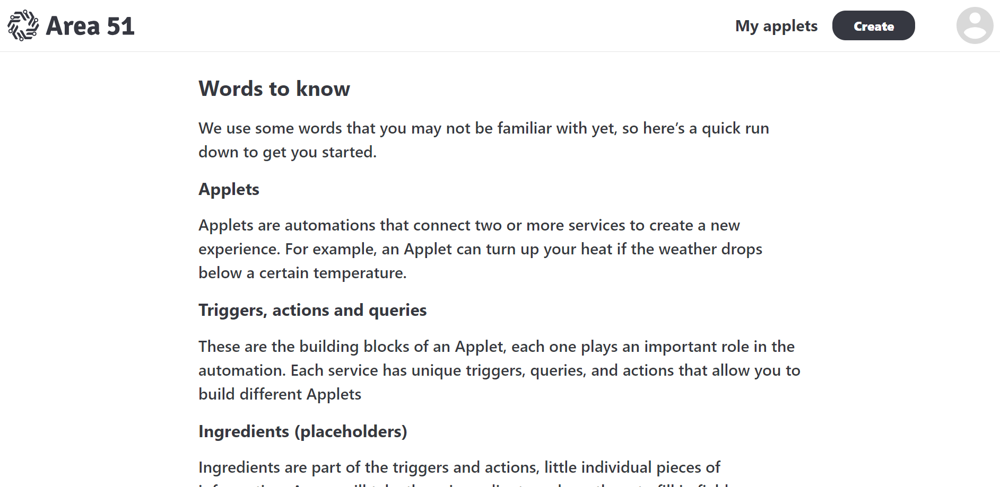
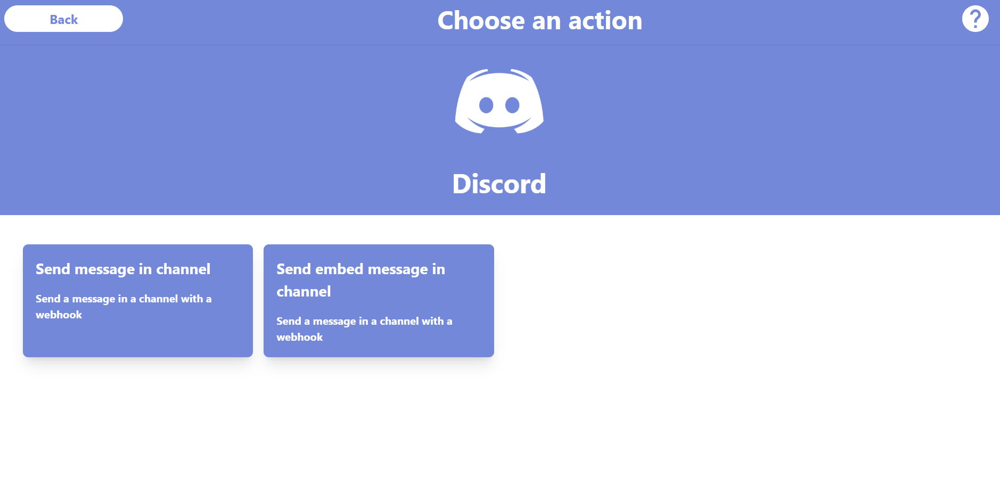
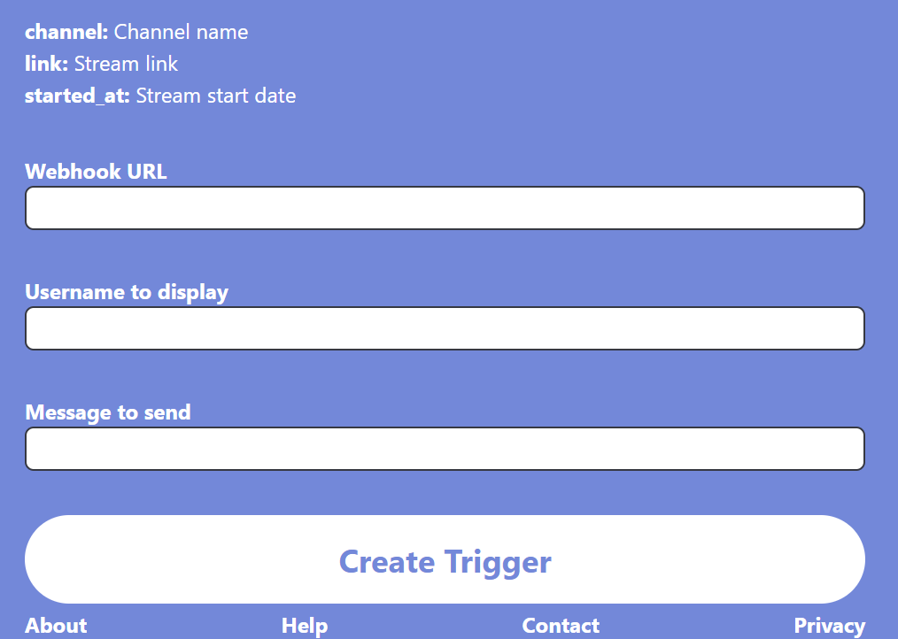

# Web

You can see here the documentation of the web application.

## Login and Sign up

When you open the website for the first time, you will arrive at the home page, as shown in the following image.
You have two options, the first one is to download the apk if you want to use it as a mobile application, the second one is to log in or sign up to use it directly as a website.

If you want to use the mobile application click on the **download Apk** button to get the apk and see the  [mobile documentation](Mobile.md).

Let's return on the log in sign up subject.
First at all, you need to configure the server address if this is your first connection. To do this, click on the "Settings" button at the top left of the screen. A modal will appear, as shown in the following image.

To use the web application you must first log in. To do this, you must enter your email and password.

When you have entered your email and password, you can click on the "Login" button. If you do not have an account, you can create one by clicking on the "Sign up" button. You will then be redirected to the registration page.

If you do not have an account, you can create one by clicking on the "Sign up" button. You will then be redirected to the registration page.

If you want, you can create an account with your Google account. To do this, click on the "Log in with Google" button. You will then be redirected to the Google authentication page.

So when you come back to the application, you can log in with your Google account, when clicking on the "Log in with Google" button.

## Your applets
Once logged in, you will arrive at the 'Your applets' page.

Here you can find all the applets you have created, with the action and reaction(s) icons, name of the applet, and it status (enabled or disabled).
When you click on an applet, you will be redirected to the applet page.

You can search for an applet in 'Your applets' page by clicking on the search bar at the top of the page.

## Applet page
On the applet page, you can see the applet name, the action and reaction(s) icons, the status of the applet (enabled or disabled), the date of creation and the date of last trigger.

You can click on the 'More details' button to see more details about the applet composition.

You can disable or enable the applet by clicking on the 'Enable' or 'Disable' button.
If the name of the applet is too boring, you can change it by clicking on the 'Edit title' button.

You can disable or enable notifications for the applet by clicking on the 'Enable notifications' or 'Disable notifications' button.

You can also delete the applet by clicking on the 'Delete' button.

You can also click on the 'Edit' button to edit the applet, represented by a gear icon.

## Applet edit
When you click on the 'Edit' button, you will be redirected to the applet edit page.

For more details about the applet edit page, please refer to the [Applet create page](#applet-create-page) section.

## Explore Services
When you come back to the service page, you will be able to explore services.

Here you can find all the services available on Area51. You can click on a service to go to the applet page
On the service details page, you can see the service name, his actions and reactions, and if you click on the 'Information Button', reprensented by a '?' icon, you can see more details about how to use a service.

...

## Applet create page
When you click on the 'Create' button in the bar of navigation, you will be redirected to the applet create page.

Start by choosing an action. To do this, click on the 'Choose an action' button.

The page is similar to the 'Explore Service' page. You can search for an action by clicking on the search bar at the top of the page.

In this case, we have chosen 'Twitch' service. You can see all the actions available for this service.

When you have chosen a service, you will be redirected to the service OAuth page. You must authorize Area51 to use the service.

After that, you will be redirected on the action page. You can see all the actions available for this service. You can must fill the fields required by the action.

In the case of the action 'On stream start', you must fill in the channel name.

When you have filled in the channel ID, you can click on the 'Create Trigger' button to go to the next step.

You will be redirected to the applet creation page. You can see the action you have chosen, and you can choose a reaction by clicking on the 'REAction' button.

As for the action, you can search for a reaction service by clicking on the search bar at the top of the page.
In this case, we have chosen 'Discord' service. You can see all the reactions available for this service.

When you have chosen a reaction, you will be redirected to the service OAuth page. You must authorize Area51 to use the service.
After that, you will be redirected on the reaction page. You can see all the reactions available for this service. You must fill the fields required by the reaction.

In the case of the reaction 'Send a message', you must fill in the channel ID and the message.
As you can see, to add values get from the action you can use bold ingredients using {} like so: {channel}.

Once you have finished filling in the fields, you can click on the 'Create Trigger' button to go to the next step.
You will be redirected to the applet creation page. You can see the action and the reaction you have chosen. If you want, you can change the action/reaction, or you can add a new reaction by clicking on the '+' button. You can do this for a total of 9 reactions.

When you finished, you can click on 'Continue' button, you will have to choose a title and the creation will be confirmed, you will be redirected to the applet details page.

As you can see we have a new applet created just yet

## Profile page
When you click on the 'Profile' button in the bar of navigation, you will be redirected to the profile page.

In this page, you can see your username, your email, and more information about your account.

You can change your username by clicking on it, as for your email, and save the changes by clicking on the 'Apply changes' button.
You can also change your password by clicking on the 'Change password ?' button.

You can find a list with all the services that have Oauth2 to Area51. You can click on a service to link or unlink it to your account.

You can also log out by clicking on the 'Logout' button.
And you can delete your account by clicking on the 'Delete account' button. You will be asked to confirm the deletion of your account.

